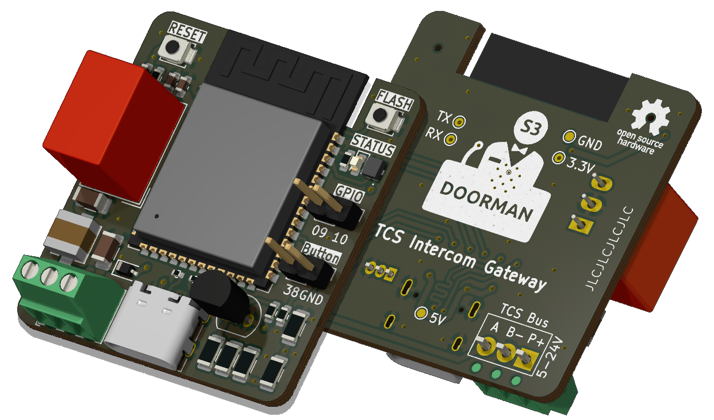

<h1 align="center">
     
    Doorman S3
     
     
    
     
</h1>

This repository contains the source files for the Doorman S3 - TCS Intercom Gateway, a device which lets you connect your [TCS](https://www.tcsag.de/) Intercom to any home automation system.

<!--
## 📦 Interested in buying one?

I still have some PCBs left. They are fully assembled and tested and come with ESPHome pre-Installed for direct integration and adoption into Home Assistant.

Feel free to contact me on [Discord](https://discord.gg/MMT4bxhQ68) or by [E-Mail](mailto:flo@azon.ai?subject=Doorman).
-->

## 📫 Have a question? Ran into a problem?

I'm happy to answer your questions on [Discord](https://discord.gg/MMT4bxhQ68) or [GitHub Issues](https://github.com/AzonInc/Doorman/issues).

## 🚩 Repository Structure

At the root of the repository you will find these directories:

- `pcb`: KiCad schematic and PCB design files
- `firmware`: ESPHome configuration files

## 🤖 Features

- Powered by ESP32-S3
- USB-C port for easy flashing (and because USB-C is cool 😎)
- It's super small (37.2mm x 35mm) and fits almost everywhere
- Configurable WS2812B RGB LED to indicate specific events
- 2 additional GPIO pins for easy expansion with your own sensors and devices
- External Button Connector
- TCS Bus Communication (e.g. Open the front door, Detect Doorbell)
- You can optionally use your Doorman as a Nuki Bridge replacement

## 🚀 Automation

The ESPHome Doorman Stock Firmware implements the following:
- **Party Mode**\
Automatically opens the Door when the Doorbell is pressed.\
The Party Mode Switch Entity is disabled by default.

Furthermore you could implement the following:
- **Doorbell Button Pattern Detection**\
Automatically open the door when the Doorbell is pressed x times in a certain way.\
You can find an Example in the [Firmware Examples](https://github.com/AzonInc/Doorman/tree/master/firmware/examples) directory.

## ✔️ Compatibility

### Hardware
If your TCS Intercom got a, b and P labeled Screw Terminals it's likely compatible.

### Firmware
You can use Doorman S3 with your prefered Firmware.\
There are a few Options:
- **[ESPHome - Doorman Stock](https://github.com/AzonInc/doorman/tree/master/firmware)**\
This is the prefered Firmware as it works out of the Box with the Doorman S3 Firmware Configuration Files.

- **[ESPHome - Doorman Nuki-Bridge](https://github.com/AzonInc/doorman/tree/master/firmware)**\
This Configuration inherits everything from the Stock Firmware and adds a Nuki Bridge Component via BLE on top.

- **[Doorman by peteh](https://github.com/peteh/doorman)**\
You need to adjust a few things to make it work with Doorman S3.

## ⚡ Wiring
>⚠️ **DO NOT USE THE +24V P-LINE AND USB-C AT THE SAME TIME**

If your Intercom is connected in 2-wire mode you need to use a USB-C Power Supply as the Bus Voltage is not sufficient to power your Doorman while sending commands. If it is connected in 3-wire mode you should be able to use the P-Line to power Doorman.

>⚠️ **THERE IS A CATCH**\
> The Power Supply of your Intercom **must have** a minimum output of **100-150mA**!\
> Otherwise your Doorman is gonna drain all the power.\
> In the worst case you could even cause severe damage.\
> **Please power your Doorman with a USB-C Power Supply if your Intercom provides less than 100mA.**

### Wire Explanation:
- **a** is usually the Bus line (+24V, but not recommended as power supply)
- **b** is usually GND
- **P** is the +24V line in 3-wire mode or just the apartment bell button in 2-wire mode

### Steps:
#### 2-Wire Mode
1. Open the intercom enclosure in your flat
2. Connect the 24V Bus Line to the A Terminal of your Doorman
3. Connect the Ground Line to the B Terminal of your Doorman
4. Connect an external Power Supply via USB-C Port or P (+5V to +24V) and B (Ground) Screw Terminals of your Doorman

#### 3-Wire Mode with sufficient Intercom Power Supply (min. 100mA)
1. Open the intercom enclosure in your flat
2. Connect the 24V Bus Line to the A Terminal of your Doorman
3. Connect the Ground Line to the B Terminal of your Doorman
4. Connect the P Line to the P Terminal of your Doorman 

## 📟 How to obtain Command Codes from the TCS Bus

Depending on the Firmware you are going to use there are different methods to obtain Command Codes.

- **[ESPHome](https://github.com/AzonInc/doorman/tree/master/firmware)**\
If you use the ESPHome Doorman Firmware from this Repository, every received Command Code is logged in the ESPHome Console and also published as an Home Assistant Event. Besides that there is a "Last Bus Command" Text Sensor (disabled by default) which also shows the last Bus Command.

- **[Doorman by peteh](https://github.com/peteh/doorman)**\
You can find a detailed explanation in the repository. It's kinda similar.

<!--
## Manufacturing

-->

## ⚠️ Disclaimer

Please DO NOT use the +24V P-Line if the Power Supply is not powerful enough.\
Check your Power Supply first because there are some Power Supply Models which supply 60mA (Peak 100mA) only and that's definitely not enough for an ESP32.

You could cause the Power Supply to overheat and end up damaging the whole system!\
Please check everything first.

## 🙌 Contributing
If you would like to contribute, please feel free to open a Pull Request.

## 📜 Credits

Doorman is heavily built on the code and the information of the following projects.\
This project would not have been possible without all of them. ❤️

**[TCSIntercomArduino](https://github.com/atc1441/TCSintercomArduino)**\
Different Methods to read from and write to the TCS Bus.\
Feel free to watch the [Reverse Engineering Video](https://www.youtube.com/watch?v=xFLoauqj9yA&t=11s) if you're interested.

**[tcs-monitor](https://github.com/Syralist/tcs-monitor)**\
An mqtt monitor for listening to the TCS Bus.\
You can find more information in this [Blog Post](https://blog.syralist.de/posts/smarthome/klingel/).

**[Doorman](https://github.com/peteh/doorman)**\
A lot of this Doorman project is based on peteh's one.\
The main goal is to provide a proper PCB for his Doorman Project.

**[ESPHome_nuki_lock](https://github.com/uriyacovy/ESPHome_nuki_lock)**\
This module builds an ESPHome lock platform for Nuki Smartlock (nuki_lock).