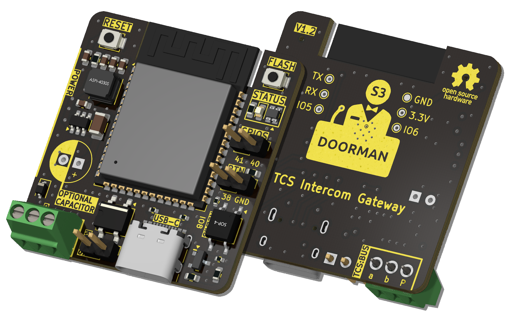
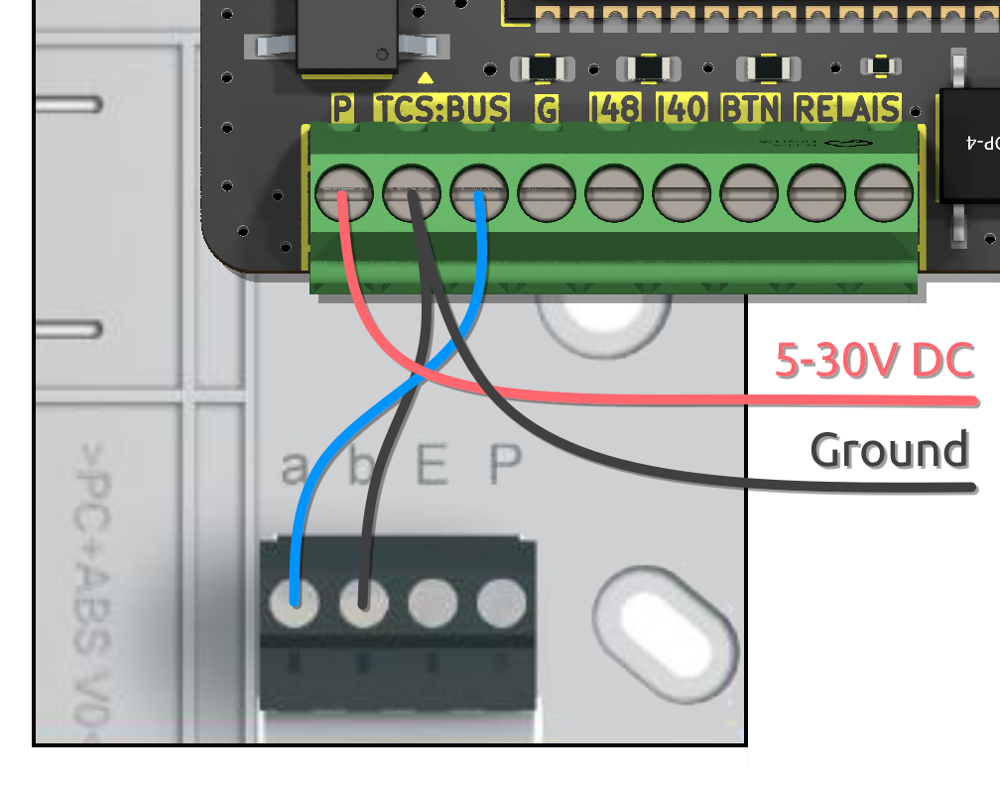
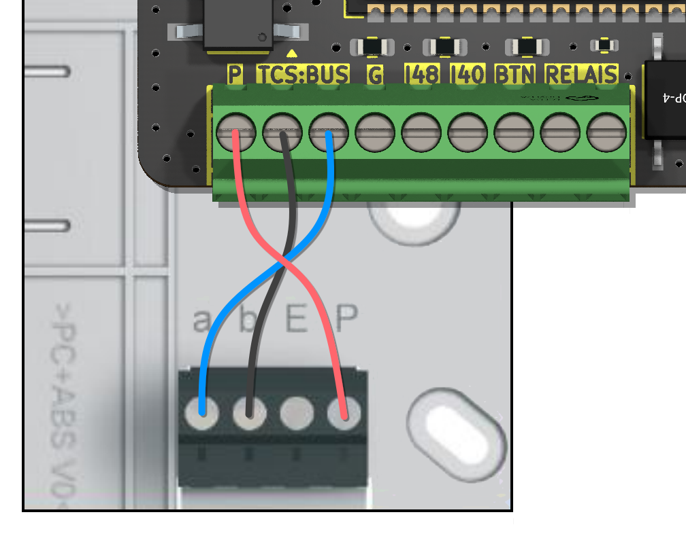
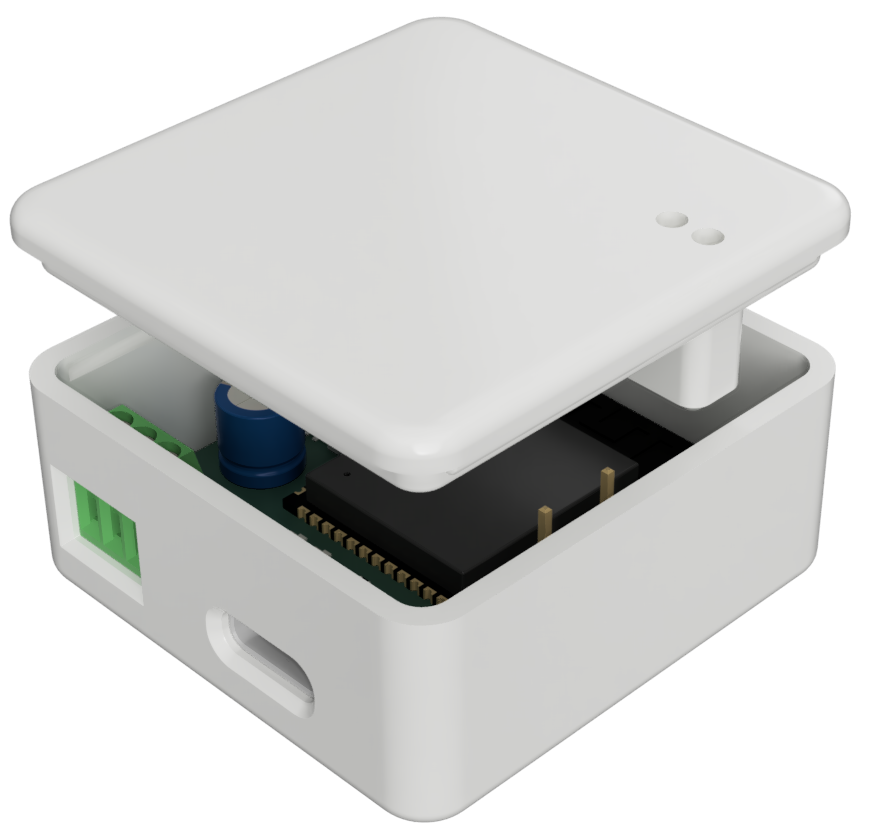

<h1 align="center">
     
    Doorman S3
     
     
    
     
</h1>

This repository contains the source files for the Doorman S3 Intercom Gateway, a device which lets you connect your [TCS](https://www.tcsag.de/) or [Koch](https://www.kochag.ch/) intercom to any home automation system.

However it's not limited to TCS and Koch intercoms only.
With the integrated relais you can easily simulate a button press to trigger the door opener or the light (up to 40V, max 2.5A).

If your intercom is not a TCS or Koch one but operates on a 2-wire bus (14-24V) it might be possible to implement other protocols as well.

You could also monitor the voltage level on older intercoms (14-24V) by replacing the tcs_intercom component with a template Binary Sensor combined with ADC and trigger specific actions based on it.

<!--
## 📦 Interested in buying one?

I still have some PCBs left. They are fully assembled and tested and come with ESPHome pre-Installed for direct integration and adoption into Home Assistant.

Feel free to contact me on [Discord](https://discord.gg/t2d34dvmBf), [GitHub Issues](https://github.com/AzonInc/Doorman/issues) or by [E-Mail](mailto:flo@azon.ai?subject=Doorman).
-->

## 📫 Have a question? Ran into a problem?

I'm happy to answer your questions on [Discord](https://discord.gg/t2d34dvmBf) or [GitHub Issues](https://github.com/AzonInc/Doorman/issues).

## 🚩 Repository Structure

At the root of the repository you will find these directories:

- `pcb`: KiCad schematic and PCB design files
- `firmware`: ESPHome configuration files
- `enclosure`: Enclosure STL Files

## 🤖 Features

- Powered by ESP32-S3
- USB-C port for easy flashing (and because USB-C is cool 😎)
- It's super small (37mm x 37mm) and fits almost everywhere
- Configurable WS2812B RGB LED to indicate specific events
- 2 additional GPIO via Screw Terminal for easy expansion with your own sensors and devices
- 1 Relay via Screw Terminal to switch up to 40V (max. 2.5A) for oldschool intercom systems
- 1 External Button via Screw Terminal (G + BTN)
- Bridge Rectifier for the Bus-wire input to correct polarity
- TCS Bus Communication (e.g. Open the front door, Detect Doorbell)
- You can optionally use your Doorman as a Nuki Bridge (incompatible with Nuki App, Bluetooth only)

## 🚀 Automation

The ESPHome Doorman Stock Firmware implements the following:
- **Party Mode**\
Automatically opens the Door when the doorbell button is pressed.\
The Party Mode Switch Entity is disabled by default.

Furthermore you could implement the following:
- **Doorbell Button Pattern Detection**\
Automatically open the door when the Doorbell is pressed x times in a certain way.\
You can find an Example in the [Firmware Examples](https://github.com/AzonInc/Doorman/tree/master/firmware/examples) directory.

## ✔️ Compatibility

### Hardware
If your TCS or Koch Intercom got a, b and P labeled Screw Terminals and is operating on 24V DC it's likely compatible.

### Firmware
You can use Doorman S3 with your prefered Firmware.\
There are a few Options:
- **[ESPHome - Doorman Stock](https://github.com/AzonInc/doorman/tree/master/firmware)**\
This is the prefered Firmware as it works out of the Box with the Doorman S3 Firmware Configuration Files.

- **[ESPHome - Doorman Nuki-Bridge](https://github.com/AzonInc/doorman/tree/master/firmware)**\
This Configuration inherits everything from the Stock Firmware and adds a Nuki Bridge Component via BLE on top.

- **[Doorman by peteh](https://github.com/peteh/doorman)**\
You need to adjust a few things to make it work with Doorman S3.

## ⚡ Wiring
If your Intercom is connected in 2-wire mode and you dont have a separate 24V P-Line you need to use an external Power Supply via USB-C or P (+5V to +30V) and B (Ground) Screw Terminal.\
If it is connected in 3-wire mode you should be able to use the P-Line to power your Doorman in most cases.

### Intercom Screw Terminal Explanation:
- **a** is usually the Bus line (+24V)
- **b** is usually GND
- **P** is the +24V line in 3-wire mode or just the apartment bell button in 2-wire mode

> ✅ On some installations the a and b wires are twisted but it doesn't matter because Doorman has an integrated bridge rectifier to handles that for you.

>⚠️ **BE AWARE**\
> The minimum output current of the intercom power supply **must be 60mA** in order to achieve a stable operation!\
> However it is possible that some other devices using the 24V-wire are taking too much current so it's not sufficient to power Doorman anymore.\
> A best case scenario would be that you can use the P-wire with 60mA. That doesn't work for everyone tho.\
>
> **Please power your Doorman with an external Power Supply (USB-C or Screw Terminal) if your intercoms power supply provides less than 60mA or whenever you notice an unstable operation.** 

>⚠️ **DO NOT USE THE +24V P-LINE AND USB-C AT THE SAME TIME**

### Possible Wiring:
#### 2-Wire Mode (with external Power Supply)

>⚠️ Please check the polarity of a- and b-wires as the bridge rectifier can only handle two wires but not three.
> Be sure to connect the ground wire of your external power supply to the same Screw Terminal as the ground wire that comes from your intercom.

1. Open the Intercom enclosure
2. Connect the a-wire (24V Bus) to one of the TCS:BUS-Terminals of your Doorman
3. Connect the b-wire (Ground) to the other TCS:BUS-Terminal of your Doorman
4. Connect an external Power Supply via USB-C Port or P (+5V to +30V) and b (Ground) Screw Terminals of your Doorman

#### 2-Wire Mode (with external Power Supply via USB-C)

1. Open the Intercom enclosure
2. Connect the a-wire (24V Bus) to one of the TCS:BUS-Terminals of your Doorman
3. Connect the b-wire (Ground) to the other TCS:BUS-Terminal of your Doorman
4. Connect an external Power Supply via USB-C Port

#### 2-Wire Mode (with power via a-Terminal)

1. Open the Intercom enclosure
2. Connect the a-wire (24V Bus) to one of the TCS:BUS-Terminals of your Doorman
3. Connect the b-wire (Ground) to the other TCS:BUS-Terminal of your Doorman
4. Connect the a-wire (24V Bus) to the P-Terminal of your Doorman

#### 3-Wire Mode (with sufficient Intercom Power Supply - min. 60mA)

1. Open the Intercom enclosure
2. Connect the a-wire (24V Bus) to one of the TCS:BUS-Terminals of your Doorman
3. Connect the b-wire (Ground) to the other TCS:BUS-Terminal of your Doorman
4. Connect the P-wire (+24V) to the P-Terminal of your Doorman 

## 📟 Obtaining Command Codes from the Bus

Depending on the Firmware you are using, there are different methods to obtain Command Codes.

- **[ESPHome](https://github.com/AzonInc/doorman/tree/master/firmware)**\
If you use the ESPHome Doorman Firmware from this Repository, every received Command Code is logged in the ESPHome Console and also published as an Home Assistant Event. Besides that there is a "Last Bus Command" Text Sensor (disabled by default) which also shows the last Bus Command.

- **[Doorman by peteh](https://github.com/peteh/doorman)**\
You can find a detailed explanation in the repository. It's kinda similar.

## 🛠️ Manufacturing

TODO

## 🖨️ Enclosure

In case you want an enclosure you can print your own one.\
Just use the STL files provided [here](https://github.com/AzonInc/Doorman/tree/master/enclosure) and you'll be good to go.\

## ⚠️ Disclaimer

Please DO NOT use the +24V P-Line if the Power Supply is not powerful enough.\
It is possible that the intercoms power supply can not provide enough power because other devices are taking too much current.\
In that case you need to use an external power supply via USB-C or Screw Terminals (P and one of TCS:BUS).

## 🙌 Contributing
If you would like to contribute, please feel free to open a Pull Request.

## 📜 Credits

Doorman is heavily built on the code and the information of the following projects and people.\
This project would not have been possible without all of them. ❤️

**[TCSIntercomArduino](https://github.com/atc1441/TCSintercomArduino)**\
Different Methods to read from and write to the TCS Bus.\
Feel free to watch the [Reverse Engineering Video](https://www.youtube.com/watch?v=xFLoauqj9yA) if you're interested.

**[tcs-monitor](https://github.com/Syralist/tcs-monitor)**\
An mqtt monitor for listening to the TCS Bus.\
You can find more information in this [Blog Post](https://blog.syralist.de/posts/smarthome/klingel/).

**[Doorman](https://github.com/peteh/doorman)**\
A lot of this Doorman project is based on peteh's one.\
The main goal is to provide a proper PCB for his Doorman Project.

**[ESPHome_nuki_lock](https://github.com/uriyacovy/ESPHome_nuki_lock)**\
This module builds an ESPHome lock platform for Nuki Smartlock (nuki_lock).

**[AStrehlau](https://github.com/AStrehlau)**\
Thanks a lot for your time, patience, knowledge and every single valuable advice that made this Project better, smaller and more affordable.