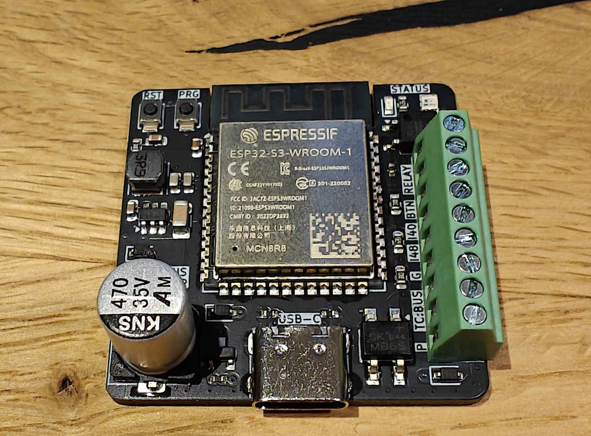

<h1 align="center">
     
    Doorman S3
     
     
    
     
</h1>

**Doorman S3** is a versatile intercom gateway designed to connect your [TCS](https://www.tcsag.de/) or [Koch](https://www.kochag.ch/) intercom system to any home automation platform. It's also compatible with rebranded versions of [Niko](https://www.niko.eu/), [Scantron](https://scantron.dk/), and older [Jung](https://www.jung-group.com/) intercom models.

But that's not all - the **Doorman S3** is more than just an intercom bridge. With its integrated relay, you can simulate button presses to control door openers or lights, supporting up to **40V** and a maximum of **2.5A**. 

Even if your intercom system isn't directly listed, if it operates on a **2-wire bus** in the **14-24V DC range**, you may still be able to implement other protocols. Additionally, you can monitor voltage levels from older intercom systems to trigger actions based on those readings.

For more information on the manufacturing process, head to the **Manufacturing** section further down.

---

  <ul style="list-style: none">
    

      <h1>🚀 Getting started</h1>
    

  </ul>

Before diving into the installation process, visit the [Doorman Docs](https://doorman.azon.ai/) for comprehensive setup guides. If you have questions, don't hesitate to reach out on [Discord](https://discord.gg/t2d34dvmBf) or [GitHub Issues](https://github.com/azoninc/doorman/issues). I'm here to assist!

---

  <ul style="list-style: none">
    

      <h1>📦 Interested in buying one?</h1>
    

  </ul>

You can get fully assembled **Doorman S3** units with the **[Stock Firmware](firmware/stock-firmware)** pre-installed and ready for immediate integration into **Home Assistant**. 

For inquiries, feel free to reach out via:
- [Discord](https://discord.gg/t2d34dvmBf)
- [E-Mail](mailto:flo@azon.ai?subject=Doorman)

---

  <ul style="list-style: none">
    

      <h1>🛠️ Built Your Own Hardware?</h1>
    

  </ul>

Check out the [TC:BUS ESPHome component documentation](https://doorman.azon.ai/reference/esphome-component) for detailed instructions on integrating your DIY hardware with the TC:BUS. Whether you're expanding your **Doorman project** or using it as a starting point for your own system, this resource will guide you through seamless integration.

---

  <ul style="list-style: none">
    

      <h1>🤖 Features</h1>
    

  </ul>

- **ESP32-S3 Powered** for robust performance
- **USB-C port** for effortless flashing (because USB-C is just cool 😎)
- **Compact design** fits into any setup
- **Configurable WS2812B RGB LED** for event-based visual indicators
- **Two additional GPIOs** for easy expansion (e.g., I²C sensors)
- **Solid-state relay** for switching up to 40V (max. 2.5A)—perfect for older intercom systems
- **External Button** (G + BTN) for manual triggering
- **Bridge Rectifier** for correcting polarity on bus-wire input
- **TC:BUS Communication** for door functions and detecting the doorbell
- **Nuki Bridge functionality** with the [Nuki Bridge Firmware](https://doorman.azon.ai/guide/firmware/nuki-bridge-firmware) (Note: Incompatible with Nuki app but works with **Home Assistant** app)

---

  <ul style="list-style: none">
    

      <h1>✔️ Compatibility</h1>
    

  </ul>

If your TCS or Koch intercom uses **screw terminals labeled `a`, `b`, and `P`** and operates on **24V DC**, it's most likely compatible with **Doorman**.

For more in-depth compatibility information, refer to the [Compatibility Docs](https://doorman.azon.ai/guide/hardware-compatibility).

---

  <ul style="list-style: none">
    

      <h1>🛠️ Manufacturing</h1>
    

  </ul>

A huge thanks to [PCBX](https://www.pcbx.com/?mtm_campaign=review&mtm_kwd=BD&mtm_source=flo) for manufacturing and sponsoring 10 awesome PCBs for this project! Your support means a lot to us, and your prices are seriously hard to beat. We're thrilled to have you on board!

If you're looking for a reliable PCB manufacturer for your own project, definitely check out [PCBX](https://www.pcbx.com/?mtm_campaign=review&mtm_kwd=BD&mtm_source=flo). While their production might take a little longer than some others, the unbeatable prices and super-easy part sourcing make it absolutely worth it. They handle everything for you!  

You can find all the necessary files for manufacturing the **Doorman-S3** [here](https://github.com/azoninc/doorman/tree/master/pcb).

---

  <ul style="list-style: none">
    

      <h1>🙌 Contributing</h1>
    

  </ul>

Contributions to the **Doorman** project are always welcome! Whether it's code improvements, bug fixes, or documentation updates, your help is greatly appreciated. Please feel free to open a **Pull Request**.

---

  <ul style="list-style: none">
    

      <h1>🚩 Repository Structure</h1>
    

  </ul>

The repository is organized as follows:
- **`blueprints`**: Automation Blueprints for Home Assistant
- **`components`**: External component files for ESPHome
- **`docs`**: Documentation
- **`enclosure`**: STL design files for the enclosure
- **`firmware`**: ESPHome configuration files
- **`pcb`**: KiCad schematic and PCB design files

---

  <ul style="list-style: none">
    

      <h1>📜 Credits</h1>
    

  </ul>

The **Doorman S3** project heavily relies on contributions from several key sources. Without their efforts, this project wouldn't be where it is today. ❤️

**[TCSIntercomArduino](https://github.com/atc1441/TCSintercomArduino)**\
Different Methods to read from and write to the TCS Bus.\
Feel free to watch the [Reverse Engineering Video](https://www.youtube.com/watch?v=xFLoauqj9yA) if you're interested.

**[tcs-monitor](https://github.com/Syralist/tcs-monitor)**\
An mqtt monitor for listening to the TCS Bus.\
You can find more information in this [Blog Post](https://blog.syralist.de/posts/smarthome/klingel/).

**[Doorman](https://github.com/peteh/doorman)**\
A lot of this Doorman project is based on peteh's one.\
The main goal is to provide a proper PCB for his Doorman Project.

**[ESPHome_nuki_lock](https://github.com/uriyacovy/ESPHome_nuki_lock)**\
This module builds an ESPHome lock platform for Nuki Smartlock (nuki_lock).

**[AStrehlau](https://github.com/AStrehlau)**\
Thank you so much for your time, patience, expertise, and every piece of invaluable advice that helped make this project better, smaller, and more affordable.

**[calibanorg](https://github.com/calibanorg)**\
Thank you so much for your support, both in terms of encouragement and financial assistance, in the development of Doorman.