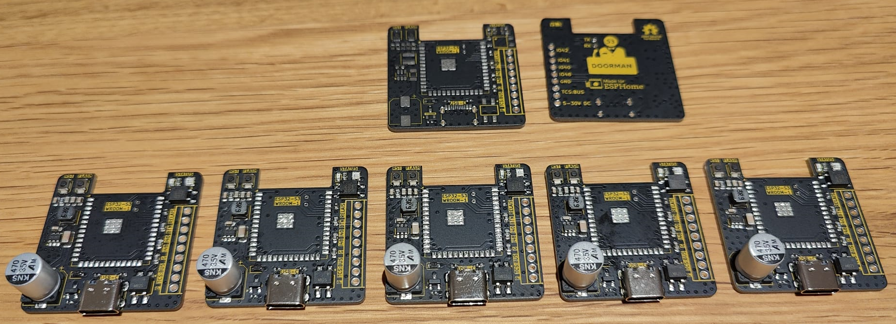

<h1 align="center">
     
    Doorman S3
     
     
    
     
</h1>

This repository provides the source files for the Doorman S3 Intercom Gateway, a device designed to connect your [TCS](https://www.tcsag.de/) or [Koch](https://www.kochag.ch/) intercom to any home automation system.\
It's also compatible with some rebranded [Niko](https://www.niko.eu/) and [Scantron](https://scantron.dk/) intercoms, which are counterparts of TCS and Koch models.

The Doorman S3 isn't limited to these intercoms alone. With its integrated relay, it can simulate button presses to trigger door openers or lights (supporting up to 40V and a maximum of 2.5A).

If your intercom isn't a TCS, Koch, Niko or Scantron model but operates on a 2-wire bus within the 14-24V range, you might be able to implement other protocols. Additionally, you can monitor the voltage levels on older intercoms (14-24V) by replacing the tcs_intercom component with a template Binary Sensor combined with the ADC, allowing you to trigger specific actions based on the voltage readings.

A big thanks to [PCBWay](https://pcbway.com) for sponsoring this project!
For more details on the manufacturing process, scroll down to the "Manufacturing" section.

## 🚀 Getting started

Be sure to visit the [Doorman Docs](https://doorman.azon.ai/) for all the information you need. If you have any questions or need further assistance, feel free to reach out on [Discord](https://discord.gg/t2d34dvmBf) or [GitHub Issues](https://github.com/AzonInc/Doorman/issues). I'm here to help!

## 📦 Interested in buying one?

Feel free to contact me on [Discord](https://discord.gg/t2d34dvmBf) or via [E-Mail](mailto:flo@azon.ai?subject=Doorman).

I offer fully assembled and tested Doorman-S3 units with the [Stock Firmware](firmware/nuki-bridge-firmware) pre-installed, ready for direct integration and adoption into Home Assistant.

## 🤖 Features

- Powered by ESP32-S3
- USB-C port for easy flashing (and because USB-C is cool 😎)
- Compact design that fits almost anywhere
- Configurable WS2812B RGB LED to indicate specific events
- Two additional GPIOs for easy expansion with your own sensors and devices (e.g., I²C)
- Solid-state relay for switching up to 40V (max. 2.5A), ideal for older intercom systems
- External Button (G + BTN)
- Bridge rectifier for bus-wire input to correct polarity
- TCS bus communication for functions like opening the front door and detecting the doorbell
- Can be used as a Nuki Bridge with the [Nuki Bridge Firmware](https://doorman.azon.ai/firmware/nuki-bridge-firmware). Note that this firmware is incompatible with the Nuki app, but it works with the Home Assistant app.

## ✔️ Compatibility

If your TCS or Koch intercom has screw terminals labeled `a`, `b`, and `P` and operates on 24V DC, it's likely compatible with Doorman.\
For detailed compatibility information, check out the [Compatibility Docs](https://doorman.azon.ai/guide/hardware-compatibility).

## 🚩 Repository Structure

The repository is organized into the following directories:

- `pcb`: Contains KiCad schematic and PCB design files
- `firmware`: Includes ESPHome configuration files
- `components`: Includes ESPHome external component files
- `enclosure`: Provides STL files for the enclosure design

## 🛠️ Manufacturing

I was unsure which PCB manufacturer to choose, but fortunately, PCBWay reached out and offered to sponsor the PCB fabrication. I couldn't be happier with the results—the quality is exceptional, especially with the vibrant colors. Everything arrived in pristine condition, and sourcing parts was hassle-free. They even included two extra unpopulated PCBs.

I handled the soldering of the ESP modules myself using a heating plate, as I already had ESP32 modules at home.

PCBWay made the entire process straightforward and responsive. A special thanks to Liam and Lynne for their support throughout, especially given the numerous changes I made. Their patience and assistance were greatly appreciated.

If you're looking for a reliable, high-quality PCB manufacturer, I highly recommend [PCBWay](https://pcbway.com) :)

You can find all the neccessary files [here](https://github.com/AzonInc/doorman/tree/master/pcb).

## 🙌 Contributing
If you'd like to contribute to the Doorman project, we welcome your involvement!\
Please feel free to open a Pull Request. Your contributions, whether they are code improvements, bug fixes, or documentation updates, are greatly appreciated.

## 📜 Credits

Doorman is heavily built on the code and insights from the following projects and individuals.\
This project would not have been possible without their contributions. ❤️

**[TCSIntercomArduino](https://github.com/atc1441/TCSintercomArduino)**\
Different Methods to read from and write to the TCS Bus.\
Feel free to watch the [Reverse Engineering Video](https://www.youtube.com/watch?v=xFLoauqj9yA) if you're interested.

**[tcs-monitor](https://github.com/Syralist/tcs-monitor)**\
An mqtt monitor for listening to the TCS Bus.\
You can find more information in this [Blog Post](https://blog.syralist.de/posts/smarthome/klingel/).

**[Doorman](https://github.com/peteh/doorman)**\
A lot of this Doorman project is based on peteh's one.\
The main goal is to provide a proper PCB for his Doorman Project.

**[ESPHome_nuki_lock](https://github.com/uriyacovy/ESPHome_nuki_lock)**\
This module builds an ESPHome lock platform for Nuki Smartlock (nuki_lock).

**[AStrehlau](https://github.com/AStrehlau)**\
Thank you so much for your time, patience, expertise, and every piece of invaluable advice that helped make this project better, smaller, and more affordable.

**[calibanorg](https://github.com/calibanorg)**\
Thank you so much for your support, both in terms of encouragement and financial assistance, in the development of Doorman.