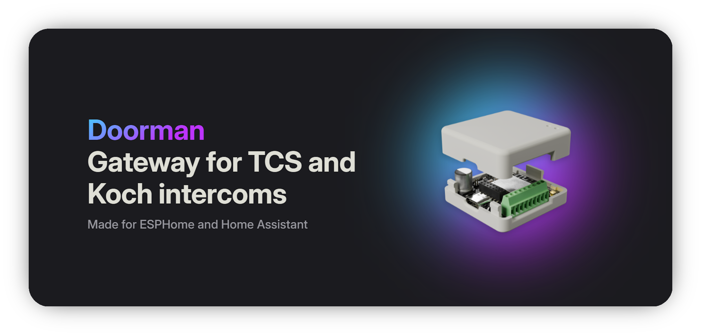
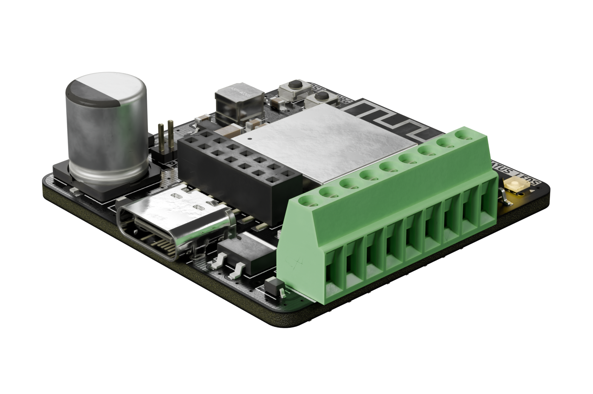

  **Doorman S3** is a versatile intercom gateway designed to connect your [TCS](https://www.tcsag.de/) or [Koch](https://www.kochag.ch/) intercom system to any home automation platform. It's also compatible with rebranded versions of [Niko](https://www.niko.eu/), [Scantron](https://scantron.dk/), and older [Jung](https://www.jung-group.com/) TKM intercom models.

  But that's not all - the **Doorman S3** is more than just an intercom bridge. With its integrated relay, you can simulate button presses to control door openers or lights, supporting up to **40V** and a maximum of **2.5A**. 

  Even if your intercom system isn't directly listed, if it operates on a **2-wire bus** in the **14-24V DC range**, you may still be able to implement other protocols. Additionally, you can monitor voltage levels from older intercom systems to trigger actions based on those readings.

  For more information on the manufacturing process, head to the **Manufacturing** section further down.

  Before diving into the installation process, visit the [Doorman Docs](https://doorman.azon.ai/) for comprehensive setup guides.

  Doorman consists of **both hardware and firmware**, so the documentation covers everything you need to get the system up and running — from preparing and assembling the hardware components to flashing and configuring the firmware. You'll find step-by-step instructions for connecting the device, installing the firmware, configuring networking and access settings, and verifying that everything is working correctly.

  If you're setting up Doorman for the first time, the **Getting Started** section is the best place to begin. The docs also include troubleshooting tips, configuration examples, and guidance for updating or customizing the firmware.

  If you have questions, run into issues, or want to discuss ideas or improvements, don't hesitate to reach out on [Discord](https://discord.gg/t2d34dvmBf) or open a discussion on [GitHub Issues](https://github.com/azoninc/doorman/issues). I'm happy to help, and the community is always welcome to share feedback, report bugs, or contribute improvements.

  As part of this open-source, community-driven project, I occasionally make fully assembled Doorman S3 hardware available with the [Doorman Firmware](https://doorman.azon.ai/guide/firmware/installation) pre-installed — ready for seamless integration with Home Assistant.

  This is **not an official, commercial or certified product**. Both the hardware and firmware are outcomes of reverse-engineering work and are offered without any **warranties concerning safety, reliability, or compatibility**.

  **Each device acquired through me directly contributes to the continued development and improvement of the Doorman project.**

  Availability is limited and occurs **without a fixed schedule**. For inquiries, please use [this page](https://doorman.azon.ai/order).

  Check out the [TC:BUS ESPHome component documentation](https://doorman.azon.ai/reference/esphome-component) for detailed instructions on integrating your DIY hardware with the TC:BUS. Whether you're expanding your **Doorman project** or using it as a starting point for your own system, this resource will guide you through seamless integration.

- **ESP32-S3 Powered** for robust performance
- **USB-C port** for effortless flashing (because USB-C is just cool 😎)
- **Compact design** fits into any setup
- **Configurable WS2812B/SK6812B RGB LED** for event-based visual indicators
- **Two additional GPIOs** for easy expansion (e.g., I²C sensors, external button)
- **Solid-state relay** for switching up to 40V (max. 2.5A)—perfect for older intercom systems
- **Bridge Rectifier** for correcting polarity on bus-wire input
- **TC:BUS Communication** for door functions and detecting the doorbell
- **SIEDLE:IN-HOME-BUS Communication** for door functions and detecting the doorbell
- **Nuki Bridge functionality** with the [Nuki Bridge Addon](https://doorman.azon.ai/guide/firmware/nuki-bridge)

  If your TCS or Koch intercom uses **screw terminals labeled `a`, `b`, and `P`** and operates on **24V DC**, it's most likely compatible with **Doorman**.

  For more in-depth compatibility information, refer to the [Compatibility Docs](https://doorman.azon.ai/guide/hardware-compatibility).

  

  

  The repository contains all the files required to produce the core board, including PCB design files, schematics, and the bill of materials (BOM). These resources enable manufacturers or developers to fabricate the board, source the necessary components, and assemble the device according to the reference design.

  You can find all the necessary files for manufacturing the **Doorman Core Board** [here](https://github.com/azoninc/doorman/tree/master/hardware/core_board).

  From my experience working with [PCBWay](https://www.pcbway.com/project/shareproject/Doorman_S3_5bdfd0fb.html), the manufacturing process was smooth and the quality exceeded expectations—especially the clean finish and vibrant PCB colors. Component sourcing was straightforward, and they even included two extra unpopulated PCBs. I soldered the ESP32 modules myself using a heating plate, since I already had modules available at home.

  Communication throughout the process was excellent. Whenever questions came up, they were addressed quickly and professionally. A special thanks goes to Liam and Lynne for their continuous support and patience, even as I made multiple changes along the way. It was genuinely a pleasure working with them.

  If you're looking for a reliable, high-quality one-stop manufacturer, I can definitely recommend [PCBWay](https://www.pcbway.com/project/shareproject/Doorman_S3_5bdfd0fb.html).

  Contributions to the Doorman project are always welcome! Whether it's code improvements, bug fixes, or documentation updates, your help is greatly appreciated. To get started, check out our [Contributing Guidelines](CONTRIBUTING.md).

  Thanks for contributing! 🚀

  The **Doorman S3** project heavily relies on contributions from several key sources. Without their efforts, this project wouldn't be where it is today. ❤️

  **[TCSIntercomArduino](https://github.com/atc1441/TCSintercomArduino)**\
  Different Methods to read from and write to the TCS Bus.\
  Feel free to watch the [Reverse Engineering Video](https://www.youtube.com/watch?v=xFLoauqj9yA) if you're interested.

  **[tcs-monitor](https://github.com/Syralist/tcs-monitor)**\
  An mqtt monitor for listening to the TCS Bus.\
  You can find more information in this [Blog Post](https://blog.syralist.de/posts/smarthome/klingel/).

  **[Doorman](https://github.com/peteh/doorman)**\
  A lot of this Doorman project is based on peteh's one.\
  The main goal is to provide a proper PCB for his Doorman Project.

  **[ESPHome_nuki_lock](https://github.com/uriyacovy/ESPHome_nuki_lock)**\
  This module builds an ESPHome lock platform for Nuki Smartlock (nuki_lock).

  **[AStrehlau](https://github.com/AStrehlau)**\
  Thank you so much for your time, patience, expertise, and every piece of invaluable advice that helped make this project better, smaller, and more affordable.

  **[calibanorg](https://github.com/calibanorg)**\
  Thank you so much for your support, both in terms of encouragement and financial assistance, in the development of Doorman.

  **[mikrocontroller.net](http://mikrocontroller.net/topic/308271)**\
  Thanks to the folks at mikrocontroller.net for figuring out the Siedle In-Home-Bus.

