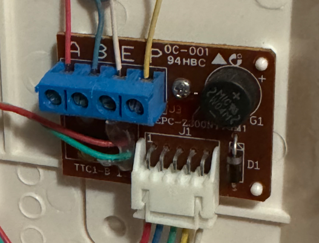

# Can I use Doorman?
If your TCS or Koch Intercom got a, b and P labeled Screw Terminals and is operating on 24V DC it's likely compatible.

There are also some rebranded Niko intercoms which are counterparts of the TCS and Koch ones.

:::danger READ - BEFORE YOU ORDER
Since this is a product of reverse engineering, there is no way to be 100% certain that a your intercom will or won't work without testing it yourself.

1. Make sure to check the wiring and measure the voltage before ordering a Doorman.

2. There is no guarantee that Doorman will work with your intercom due to the fact that every building is wired unique.

3. As stated below it is always possible that some other devices (your neighbors) using the P-line are taking too much current so it's not sufficient to power Doorman anymore. 

**You should understand this risk before purchasing.** If you have any questions, please contact me and I will be happy to help!
:::

## Wiring
If your Intercom is connected in 2-wire mode and you dont have a separate 24V P-Line you need to use an external Power Supply via USB-C or P (+5V to +30V DC) and B (Ground) Screw Terminal.
If it is connected in 3-wire mode you should be able to use the P-Line to power your Doorman in most cases.

::: tip
On some installations the a and b wires are twisted but it doesn't matter because Doorman has an integrated bridge rectifier to handles that for you.
Consider that when you check the voltage level on a, b and P lines.
:::

#### Intercom Screw Terminal Explanation
- **a** is usually the Bus line (+24V)
- **b** is usually GND
- **P** is the +24V line in 3-wire mode or just the apartment doorbell button in 2-wire mode

::: danger
**DO NOT USE THE +24V P-LINE AND USB-C AT THE SAME TIME**
:::

## Check the power supply
Use a multimeter to check the DC voltage.
Since the a and b lines can be twisted you have to measure the polarity first.

#### Expected voltage
- Between a and b: ~ 24.0V
- Between P and b: ~ 23.2V

::: warning
The minimum output current of the intercom power supply **must be 60mA** in order to achieve a stable operation!

However it is possible that some other devices using the P-line are taking too much current so it's not sufficient to power Doorman anymore.

A best case scenario would be that you can use the P-line with 60mA. That doesn't work for everyone tho.

**Please power your Doorman with an external Power Supply (USB-C or Screw Terminal) if your intercoms power supply provides less than 60mA or whenever you notice an unstable operation.** 
:::

## Known issues

Some intercom phones having a TTC1-B-1 connector module cause problems because the a and P Connector are somehow connected. However it's not clear which models are affected yet.

::: danger Problem
A loud beeping noise occurs whenever someone is talking.
:::

{width=300px}

## Tested Hardware

- TCS ISH3030 / ISH3130
- TCS ISW3030 / ISW3130