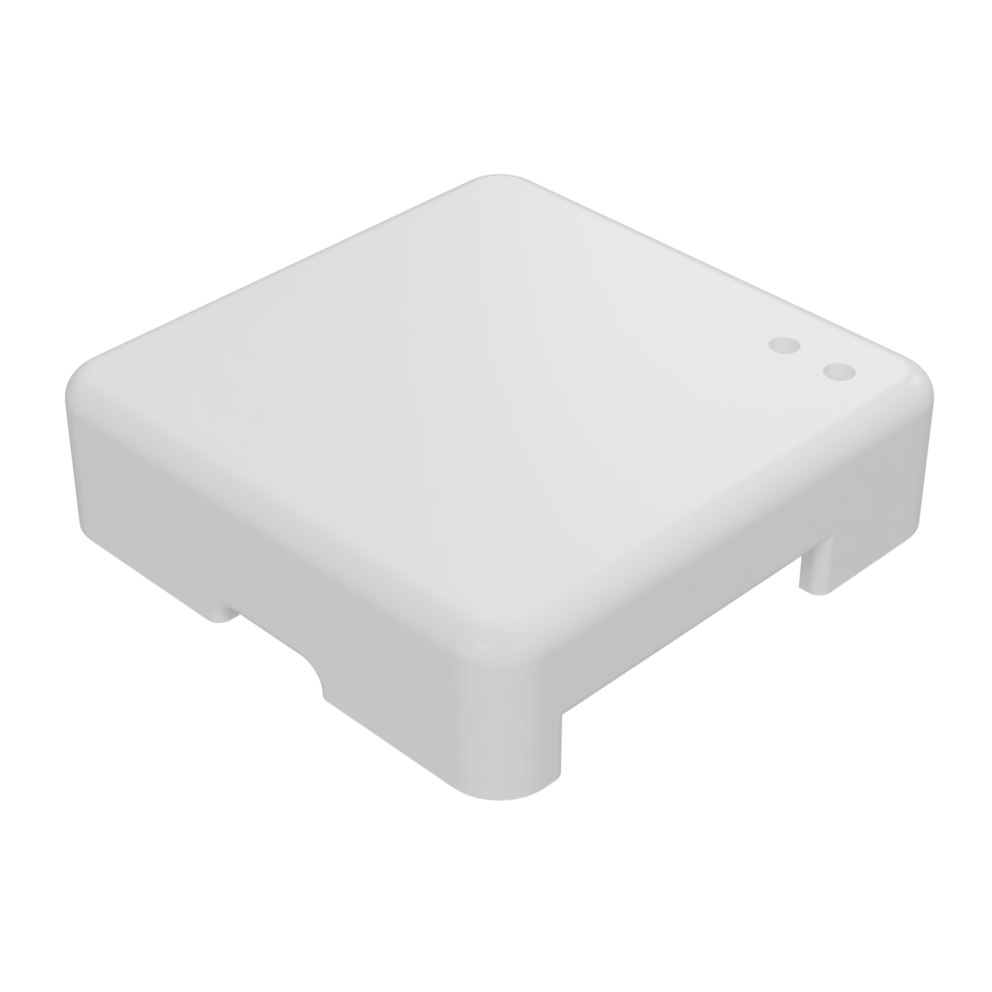
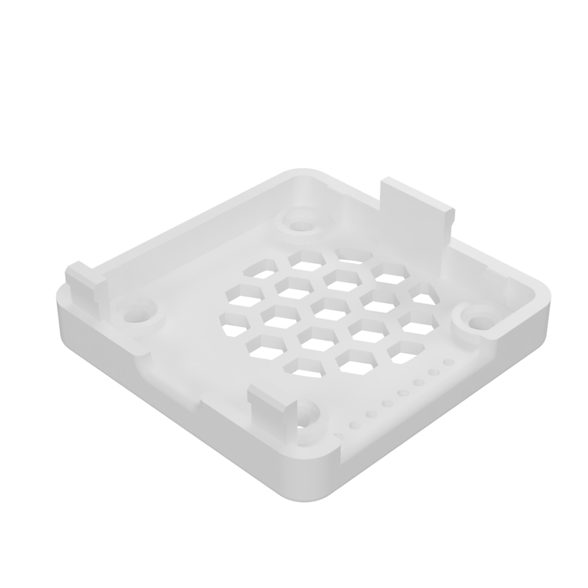

# Gehäuse

Falls du ein Gehäuse benötigst, kannst du dein eigenes drucken.\
Klicke einfach auf die Bilder unten, um die STL-Datei auf GitHub zu öffnen.

Oberseite                                    |  Unterseite
:-------------------------:|:-------------------------:
[{width=300px}](https://github.com/AzonInc/Doorman/blob/master/enclosure/Top.stl)  |  [{width=300px}](https://github.com/AzonInc/Doorman/blob/master/enclosure/Bottom.stl)

::: tip
Die STL-Dateien sind für Resin-Drucker optimiert, daher erzielst du mit einem solchen die besten Ergebnisse.
:::