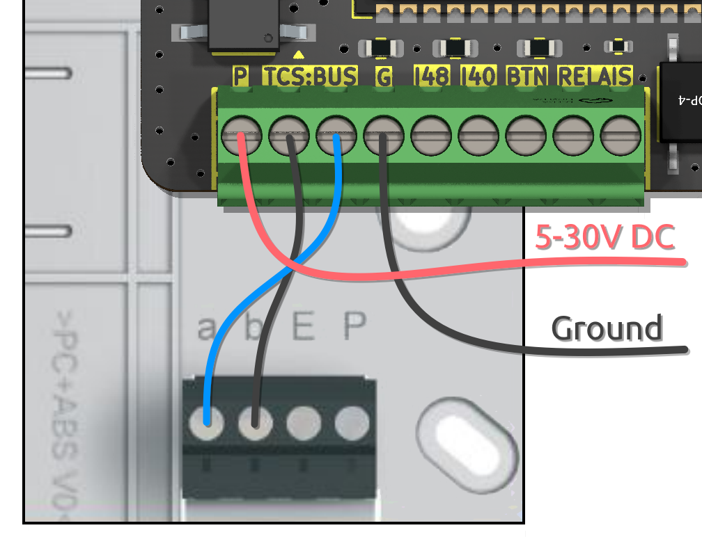
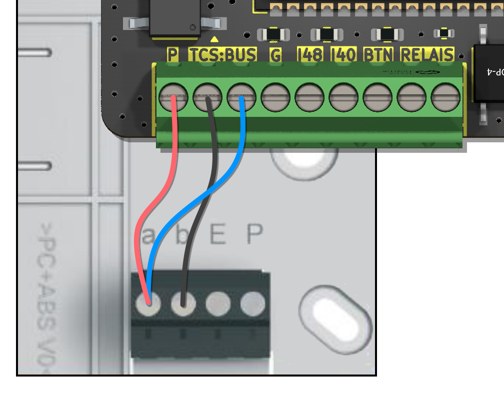
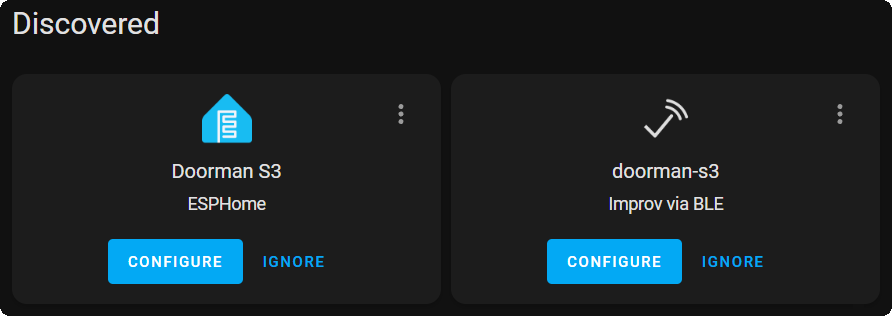

# Erste Schritte

Ist das dein erster Besuch hier? Keine Sorge, wir haben alles für dich vorbereitet!
Unten findest du eine ausführliche Anleitung zur Ersteinrichtung deines Doormans.

Bitte beachte, dass diese Anweisungen auf dem bereits geflashten Doorman-PCB basieren welches ich verkaufe.
Sofern du selbst ein PCB produzieren lassen hast, musst du zuerst die Firmware flashen. Solltest du dem nicht nachgehen, kannst du lange warten, dass irgendwas von dem unten beschriebenen passiert. 😄

**Vielen Dank, dass du Doorman verwendest! ❤️**

## Verkabelung
Öffne als Erstes das Gehäuse deiner Gegensprechanlage. In den meisten Fällen findest du dort eine Schraubklemme mit den Bezeichnungen `a`, `b`, `E` und `P`.

Schließe die `b`-Leitung (Ground) an einen der TC:BUS-Anschlüsse deines Doorman an und die `a`-Leitung (24V Bus) an den anderen TC:BUS-Anschluss deines Doorman.

### Stromversorgungsoptionen:
::: details 3-Draht-Modus über die Gegensprechanlage <Badge type="tip" text="Empfohlen" />
Verbinde die `P`-Leitung (+24V) mit dem `P`-Terminal an deinem Doorman.

> [!WARNING]
> Die Stromversorgung der Gegensprechanlage muss mindestens 60mA liefern.

Beispiel:
{width=300px}
:::

::: details 2-Draht-Modus über externe Stromversorgung
Schließe die externe Stromversorgung an deinen Doorman an. Nutze dazu die `P` (+5V bis +30V) und `G` (Ground) Schraubklemmen an deinem Doorman.

Beispiel:
{width=300px}
:::

::: details 2-Draht-Modus über externe USB-C-Stromversorgung
Schließe die externe Stromversorgung über den USB-C-Anschluss an.

Beispiel:
{width=300px}
:::

::: details 2-Draht-Modus über die Gegensprechanlage <Badge type="danger" text="Hardware Revision 1.5 und neuer" />
> [!DANGER] Diese Methode erzeugt ein leises, aber dennoch wahrnehmbares Rauschen im Lautsprecher.
> Die Nutzung der `a`-Bus-Leitung als Stromquelle führt zu einem lauten Piepton. Dieses Problem tritt wahrscheinlich aufgrund der Hochfrequenz-Schaltstromversorgung auf und könnte in zukünftigen Hardware-Versionen behoben werden.

Beispiel:
{width=300px}
:::


## Einrichtung

### Schritt 1: Mit Wi-Fi verbinden
Wenn du deinen Doorman-S3 zum ersten Mal einschaltest, wird er schnell (orange) blinken und einen neuen Access Point namens `Doorman-S3 Setup` erstellen. Du kannst deine WiFi-Zugangsdaten über den Access Point, Improv Serial oder Improv Bluetooth einrichten.

Das Passwort für den Access Point lautet `open-sesame`.

Sobald du mit dem Access Point verbunden bist, sollte sich die Web-Oberfläche automatisch öffnen (siehe auch Netzwerk-Benachrichtigungen).\
Falls nicht, kannst du manuell zu http://192.168.4.1/ in deinem Browser navigieren.

::: tip
Wenn dein Home Assistant Bluetooth aktiviert hat, kannst du die automatische Einrichtung nutzen.

Dank mDNS-Unterstützung wird Home Assistant deinen Doorman automatisch entdecken, sobald er mit dem WiFi verbunden ist.
:::


### Schritt 2: Mit Home Assistant verbinden
Nachdem du deinen Doorman mit deinem Netzwerk verbunden hast, wird die RGB Status LED langsam (blau) blinken. Er sollte automatisch von Home Assistant entdeckt werden. Klicke einfach auf `Konfigurieren`, um das neu entdeckte ESPHome-Gerät hinzuzufügen.

Falls nicht, kannst du ihn manuell per IP Addresse hinzufügen.

Nach erfolgreicher Verbindung leuchtet er für 3 sekunden lang durchgehend blau.

### Schritt 3: Interaktive Einrichtung
::: tip
Wenn du deinen Doorman zum ersten Mal mit Home Assistant verbindest,\
befindet er sich bereits im `Setup Mode` für die interaktive Einrichtung.

Du musst den Modus nicht manuell aktivieren; er wird bei jedem Neustart automatisch gestartet, solange der Einrichtungsprozess nicht abgeschlossen oder abgebrochen wurde.
:::

1. **Zugriff auf die Einstellungen:**\
   Öffne die Einstellungen entweder über den internen Webserver deines Doormans oder besuche die [ESPHome Integrationsseite](https://my.home-assistant.io/redirect/integration/?domain=esphome) und wähle das Doorman S3-Gerät aus.

2. **Setup-Modus aktivieren:**\
   Gehe zum Bereich `Konfiguration` und schalte den `Setup Mode` ein, um die interaktive Einrichtung zu beginnen.

3. **Einrichtung durchführen:**\
   Die RGB-Status-LED wird grün-türkis pulsieren. Drücke den Klingeltaster vor der Wohnung oder am Eingang.

4. **Abschluss der Einrichtung:**\
   Nach dem Drücken des Klingeltasters leuchtet die LED für 3 Sekunden durchgehend grün-türkis. Danach schaltet sich die LED aus, und die Einrichtung ist abgeschlossen.

Wenn du mehrere Außenstationen hast, wird die Firmware versuchen, die zusätzliche Station automatisch zu erkennen.
Um die Erkennung der zweiten Türklingel und das Öffnen der zweiten Tür zu ermöglichen, musst du die zweite Türklingel einmal betätigen oder die zweite Tür einmal öffnen, damit die Adresse gespeichert wird.

## ESPHome adoption
Wenn du die Firmware deines Doorman anpassen möchtest, kannst du diesen zu deinem [ESPHome-Dashboard](https://my.home-assistant.io/redirect/supervisor_ingress/?addon=5c53de3b_esphome) hinzufügen und deine angepasste [Stock](firmware/stock-firmware.md) oder [Nuki Bridge](firmware/nuki-bridge-firmware.md) Firmware flashen.

Nach dem Hinzufügen wird deine Konfiguration ungefähr so aussehen:
::: details Beispiel
> [!NOTE]
> Hier kannst du neue Komponenten hinzufügen und bestehende ändern. Weitere Informationen zu den Möglichkeiten findest du im Abschnitt [Beispiele](firmware/stock-firmware#beispiele).
>
> Wenn du die Firmware vollständig anpassen möchtest, solltest du die `base.yaml`-Datei aus dem Repository verwenden.

```yaml
substitutions:
  name: doorman-s3
  friendly_name: Doorman S3

packages:
  AzonInc.Doorman: github://AzonInc/doorman/firmware/doorman-stock.yaml@master

esphome:
  name: ${name}
  name_add_mac_suffix: false
  friendly_name: ${friendly_name}

api:
  encryption:
    key: ...

wifi:
  ssid: !secret wifi_ssid
  password: !secret wifi_password
```
:::