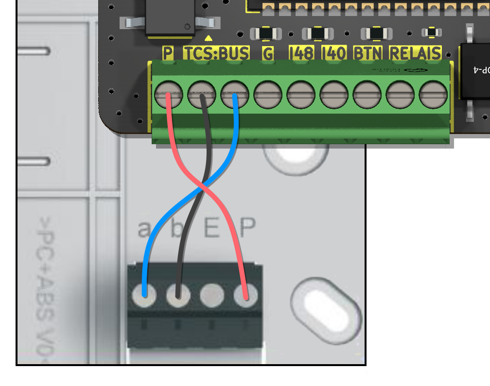
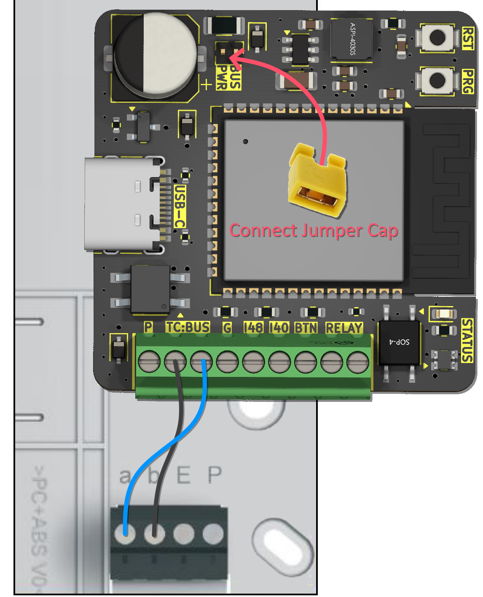
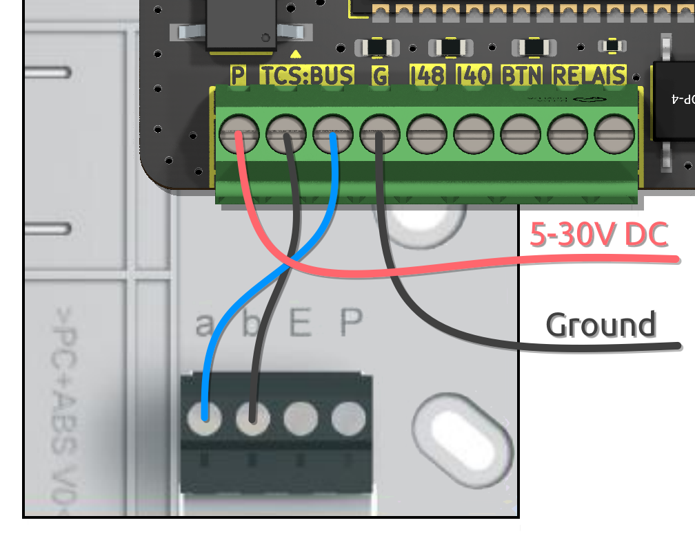
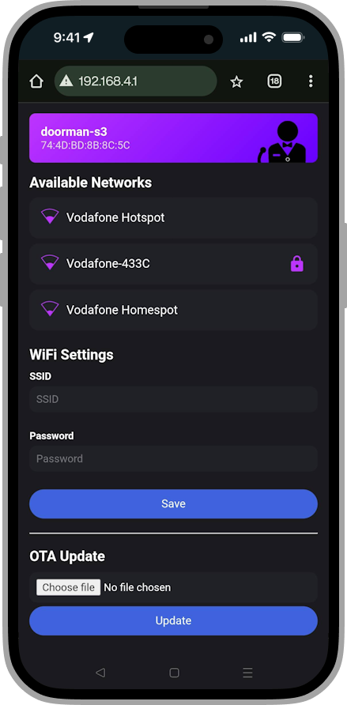
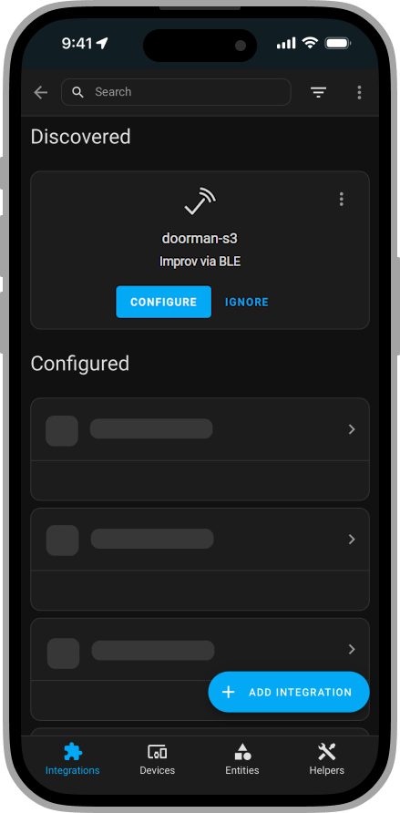

# Erste Schritte

Ist das dein erster Besuch hier? Keine Sorge, wir haben alles für dich vorbereitet! 😊

Unten findest du eine Schritt-für-Schritt-Anleitung, die dich beim ersten Einrichten deines **Doorman** begleitet. Folge einfach den Schritten — alles ist genau in der Reihenfolge, wie du es brauchst.

**Vielen Dank, dass du Doorman verwendest und dieses Projekt unterstützt! ❤️**

## Haftungsausschluss

Durch die Nutzung oder Installation von Doorman übernimmst du die volle Verantwortung für alle Änderungen an deiner Gegensprechanlage.
Das Verhalten des Systems kann je nach individueller Installation und Umgebung variieren.

Wenn du dir bei der Einrichtung oder Verkabelung unsicher bist, konsultiere bitte eine **qualifizierte Elektrofachkraft**.
Eine unsachgemäße Installation kann zu **Fehlfunktionen oder Schäden an deiner Türsprechanlage** führen.

:::tip HINWEIS
Dies ist **kein offizielles oder zertifiziertes Produkt**. Es basiert auf Reverse Engineering und wird **ohne Garantie auf Kompatibilität, Sicherheit oder Funktionalität** bereitgestellt.
:::

## Benötigte Werkzeuge und Materialien
Einige Werkzeuge und Materialien sind nicht in jedem Haushalt vorhanden. Um Doorman reibungslos einzurichten, stelle sicher, dass Du Folgendes hast:
- Einen kleinen Schlitz-Schraubendreher (~2 mm)
- 2-3 Verbindungs-Kabel (jeweils 15-30cm)
- Strom 🦖

Hast du alles? Super! Dann [RTFM](https://de.wikipedia.org/wiki/RTFM)!!

## Firmware flashen
Wenn du ein **vorgeflashtes Doorman-Board** gekauft hast, kannst du diesen Schritt einfach überspringen — du bist startklar! 🎉

Falls du aber dein **eigenes Board gebaut** hast oder die **Firmware aktualisieren** möchtest, ist jetzt der richtige Zeitpunkt zum Flashen.
Sonst sitzt du da und wunderst dich, warum nichts passiert. 😄

<a class="btn" target="_blank" href="./firmware/installation">Firmware installieren oder updaten</a>

## Kabel anschließen
Öffne als Erstes das Gehäuse deiner Innenstation. Bei den meisten Modellen findest du Schraubklemmen mit der Beschriftung `a`, `b`, `E` und `P`.

Der Doorman wird — wie jedes andere Gerät — **parallel zum Bus** angeschlossen.

::: danger VORSICHT IST BESSER ALS NACHSICHT
**Schließe NIEMALS irgendeine Stromquelle an die BUS-Terminals\* an.  
Dazu zählt auch die `P`-Leitung.** Und nein Patrick, Mayonaise ist kein Instrument.

Sobald Doorman versucht, Daten auf dem Bus zu senden, **kann das richtig üble und vielleicht irreversible Schäden verursachen.**

Bitte **überprüfe alle Verbindungen stets sorgfältig und mehrmals**, bevor du etwas anschließt.

*Die Benennung kann je nach Revision variieren: A+B, TCS:BUS oder TC:BUS.
:::

### Stromversorgungsoptionen:
::: details 3-Draht-Modus über die Innenstation <Badge type="tip" text="Empfohlen" />
> [!DANGER] WICHTIG
> **Bitte entferne die Jumper-Kappe auf `BUS PWR`, bevor du fortfährst!**
>
> Die Stromversorgung der Türsprechanlage muss **mindestens 60 mA** liefern können – das ist in der Regel der Fall.
> Da die verfügbare Leistung jedoch begrenzt ist, kann das **direkte Anschließen zusätzlicher Geräte wie des Doorman S3 an den Bus zu Instabilitäten im System führen**.

Schließe die `b`-Leitung (Ground) an den mit `B` gekennzeichneten Bus-Anschluss deines Doorman an und die `a`-Leitung (24 V Bus) an den mit `A` gekennzeichneten Anschluss. In älteren Revisionen entsprach dies dem `TCS:BUS` bzw. `TC:BUS` (über zwei Anschlüsse geführt).

Verbinde anschließend die `P`-Leitung (+24V) mit dem `P`-Terminal an deinem Doorman.

Beispiel:
{width=300px}
:::

::: details 2-Draht-Modus über die Innenstation <Badge type="danger" text="Hardware Revision 1.5 und neuer" />
> [!INFO] INFO
> Die Nutzung der `a`-Bus-Leitung als Stromquelle bei älteren Hardware Revisionen als `1.5` führt zu einem lauten Piepton. Dieses Problem tritt wahrscheinlich aufgrund der Hochfrequenz-Schaltstromversorgung auf.
>
> Ab Hardware Revision `1.5` erzeugt diese Methode nur noch ein leises, aber dennoch wahrnehmbares Rauschen im Lautsprecher.

> [!DANGER] WICHTIG
> Die Stromversorgung der Türsprechanlage muss **mindestens 60 mA** liefern können – das ist in der Regel der Fall.
> Da die verfügbare Leistung jedoch begrenzt ist, kann das **direkte Anschließen zusätzlicher Geräte wie des Doorman S3 an den Bus zu Instabilitäten im System führen**.

Schließe die `b`-Leitung (Ground) an den mit `B` gekennzeichneten Bus-Anschluss deines Doorman an und die `a`-Leitung (24 V Bus) an den mit `A` gekennzeichneten Anschluss. In älteren Revisionen entsprach dies dem `TCS:BUS` bzw. `TC:BUS` (über zwei Anschlüsse geführt).

Setze anschließend die Jumper-Kappe auf `BUS PWR`, um die Stromversorgung zu aktivieren.

Beispiel:
{width=300px}
:::

::: details 2-Draht-Modus über externe Stromversorgung
> [!DANGER] WICHTIG
> Bitte entferne die Jumper-Kappe auf `BUS PWR`, bevor du fortfährst!

> [!WARNING] BEKANNTES PROBLEM
> Du könntest Probleme beim Empfangen von Telegrammen bekommen. Wenn das passiert, brauchst du ein isoliertes Netzteil, um Störungen durch Erdrauschen zu vermeiden.  
> Das Problem entsteht, weil die Stromversorgung von Doorman nicht galvanisch getrennt ist – dadurch können zwei unterschiedliche Masseverbindungen (Grounds) miteinander gekoppelt werden.

Schließe die `b`-Leitung (Ground) an den mit `B` gekennzeichneten Bus-Anschluss deines Doorman an und die `a`-Leitung (24 V Bus) an den mit `A` gekennzeichneten Anschluss. In älteren Revisionen entsprach dies dem `TCS:BUS` bzw. `TC:BUS` (über zwei Anschlüsse geführt).

Verbinde die externe Stromversorgung mit deinem Doorman über die Schraubklemmen `P` (+5V bis +30V) und `G` (Ground).

Beispiel:
{width=300px}
:::

::: details 2-Draht-Modus über externe USB-C-Stromversorgung
> [!DANGER] WICHTIG
> Bitte entferne die Jumper-Kappe auf `BUS PWR`, bevor du fortfährst!

> [!WARNING] BEKANNTES PROBLEM
> Du könntest Probleme beim Empfangen von Telegrammen bekommen. Wenn das passiert, brauchst du einen USB-Isolator (zum Beispiel [diesen hier](https://amzn.eu/d/fYaZGTp)), um Störungen durch Erdrauschen zu vermeiden.  
> Das Problem entsteht, weil die Stromversorgung von Doorman nicht galvanisch getrennt ist – dadurch können zwei unterschiedliche Masseverbindungen (Grounds) miteinander gekoppelt werden.

Schließe die `b`-Leitung (Ground) an den mit `B` gekennzeichneten Bus-Anschluss deines Doorman an und die `a`-Leitung (24 V Bus) an den mit `A` gekennzeichneten Anschluss. In älteren Revisionen entsprach dies dem `TCS:BUS` bzw. `TC:BUS` (über zwei Anschlüsse geführt).

Verbinde anschließend die externe Stromversorgung über den USB-C-Anschluss.

Beispiel:
{width=300px}
:::

## Mit WLAN verbinden
Wenn du deinen **Doorman S3** zum ersten Mal einschaltest, beginnt die LED **schnell gelb/orange zu blinken** — das bedeutet, er ist bereit für die WLAN-Einrichtung!

Du kannst ihn auf eine von drei Arten mit dem WLAN verbinden:  
**Access Point**, **Improv Serial (USB)** oder **Improv Bluetooth**.

### Access Point

   

   1. **Verbinde dich mit dem WLAN-Netzwerk** namens `Doorman S3 Setup`.
      Verwende das Passwort: `Op3n-Sesame!`

   2. Sobald die Verbindung steht, sollte sich die **Einrichtungsseite automatisch öffnen**.
      ::: tip
      Eventuell erscheint auch ein Pop-up oder eine Benachrichtigung, um dich beim Netzwerk anzumelden.
      :::

      Falls nichts passiert, öffne einfach deinen Browser und gehe zu **http://192.168.4.1** oder klicke auf den Button unten:

      

         <a class="btn" target="_blank" href="http://192.168.4.1">Verbinde Doorman mit dem WLAN</a>
      

   3. Gib die **WLAN-Zugangsdaten** für das Netzwerk ein, mit dem dein Doorman verbunden werden soll.

   4. Sobald die Meldung **„Wi-Fi connected successfully“** erscheint, kannst du das Fenster schließen.

   5. Dein **Doorman** ist jetzt verbunden und kann in **Home Assistant** über die **ESPHome-Integration** hinzugefügt werden.

   

   

      
   

### Improv Bluetooth <Badge type="tip" text="Home Assistant" />

   

   1. Stelle sicher, dass dein **Home Assistant** auf dem neuesten Stand ist — so ist die volle Kompatibilität mit deinem **Doorman** gewährleistet.

   2. Öffne die **Home Assistant**-App auf deinem Mobilgerät.

   3. Gehe zu **Einstellungen → Geräte & Dienste**.

   4. Suche nach einem neuen Gerät namens **`doorman-s3` (Improv via BLE)** und tippe auf **Hinzufügen**.

   5. Gib die **WLAN-Zugangsdaten** für das Netzwerk ein, mit dem dein Doorman verbunden werden soll.

   6. Sobald die Meldung **„Wi-Fi connected successfully“** erscheint, bist du fertig — du kannst das Popup schließen.

   7. Dein **Doorman** ist jetzt bereit, über die **ESPHome-Integration** in Home Assistant hinzugefügt zu werden.

   

   

      
   

### Improv Bluetooth
Du kannst deinen Doorman auch über Bluetooth mit dem WLAN verbinden. Das ist eine schnelle und einfache Möglichkeit — besonders praktisch, wenn du ein Handy oder einen Laptop mit Bluetooth nutzt.

Stelle sicher, dass dein Doorman eingeschaltet und in der Nähe ist, und klicke dann auf den Button unten, um zu starten:

<improv-wifi-launch-button>
   <button slot="activate">
         

            <a class="btn">Verbinde Doorman mit dem WLAN</a>
         

   </button>
   

         

            
OH NEIN!

            
Diese Funktion wird von deinem Browser nicht unterstützt :( Bitte verwende einen Chromium-basierten Browser.

         

   

   

         

            
OH NEIN!

            
Das funktioniert mit HTTP nicht :(

         

   

</improv-wifi-launch-button>

### Improv Serial <Badge type="tip" text="USB Verbindung" />
Wenn dein Doorman nicht automatisch angezeigt wird oder du ihn zum ersten Mal einrichtest, ist diese Methode eine super Alternative.

Schließe deinen Doorman einfach per USB-Kabel an deinen Computer an und klicke dann auf den Button unten, um die WLAN-Verbindung einzurichten:

<improv-wifi-serial-launch-button>
   <button slot="activate">
         

            <a class="btn">Verbinde Doorman mit dem WLAN</a>
         

   </button>
   

         

            
OH NEIN!

            
Diese Funktion wird von deinem Browser nicht unterstützt :( Bitte verwende einen Chromium-basierten Browser.

         

   

   

         

            
OH NEIN!

            
Das funktioniert mit HTTP nicht :(

         

   

</improv-wifi-serial-launch-button>

## Zu Home Assistant hinzufügen <Badge type="tip" text="Home Assistant Integration" />

:::warning BEVOR DU WEITERMACHST
Dies ist die Standard-Variante für alle vorgeflashten Doorman-Geräte.
Diesen Schritt kannst du überspringen, wenn du nicht die Firmware mit `Home Assistant` Smart Home Integration geflasht hast.
:::

<!--@include: ./firmware/instructions/home-assistant.md-->

## MQTT Broker einrichten <Badge type="tip" text="MQTT Integration" />

:::warning BEVOR DU WEITERMACHST
Diesen Schritt kannst du überspringen, wenn du nicht die Firmware mit `MQTT` Smart Home Integration geflasht hast.
:::

<!--@include: ./firmware/instructions/mqtt.md-->

## HomeKit Pairing <Badge type="tip" text="HomeKit Integration" />

:::warning BEVOR DU WEITERMACHST
Diesen Schritt kannst du überspringen, wenn du nicht die Firmware mit `HomeKit` Smart Home Integration geflasht hast.
:::

<!--@include: ./firmware/instructions/homekit.md-->

## Interaktive Einrichtung
::: tip
Wenn du deinen Doorman zum ersten Mal mit Home Assistant verbindest,\
befindet er sich bereits im `Setup Mode` für die interaktive Einrichtung.

Du musst den Modus nicht manuell aktivieren; er wird bei jedem Neustart automatisch gestartet, solange der Einrichtungsprozess nicht abgeschlossen oder abgebrochen wurde.
:::

::: warning BEVOR DU WEITERMACHST
Deine Innenstation **muss angeschlossen sein**, damit die Einrichtung abgeschlossen werden kann.
:::

### 1. Zugriff auf die Einstellungen
Öffne die Einstellungen entweder über die Weboberfläche deines Doormans oder besuche die [ESPHome Integrationsseite](https://my.home-assistant.io/redirect/integration/?domain=esphome) und wähle das Doorman S3-Gerät aus.

### 2. Aktiviere den Setup-Modus
Geh zum Bereich `Konfiguration` (Home Assistant) bzw. `Setup` (Doorman-Weboberfläche) und schalte den `Setup-Modus` ein, um mit der interaktiven Einrichtung zu beginnen.  
Sobald der Setup-Prozess beginnt, wird die RGB-Status-LED grün-türkis pulsieren.

::: tip
Geh' auf die Doorman-Weboberfläche zu und navigiere zum Abschnitt `Setup`, um den aktuellen Einrichtungsstatus zu sehen.

Folge den dort angezeigten Anweisungen, um die Einrichtung abzuschließen.
:::

### 3. Warte, bis du auf die Klingel drückst
Wenn du die Klingel an deiner Wohnungstür oder am Eingang drückst, speichert das System als erstes die Seriennummer deiner Innenstation und versucht dann das Modell zu erkennen.

Sobald das Modell erfolgreich erkannt wurde, wird der Speicher deiner Innenstation ausgelesen.  
**Hinweis:** Der gesamte Prozess kann **bis zu 30 Sekunden** dauern.

Wenn das Modell erfolgreich erkannt wurde oder die Zeit abläuft, wird die Einrichtung abgeschlossen.

:::info BITTE BEACHTE
Die Firmware versucht alle Außenstationen automatisch zu erkennen.

Damit die **Türklingel(n)** erkannt werden und du die **Tür(en) öffnen** kannst, musst du **einmal jede Türklingel drücken** oder **die Türöffnertaste jeder Tür manuell betätigen** — aber **erst, nachdem die Einrichtung abgeschlossen ist**.

⚠️ **Die Reihenfolge ist wichtig:** Fang mit der Klingel am Haupteingang an und dann die zweite. So erkennt das System alles richtig.

🕒 Warte etwa **eine Minute nach der Einrichtung**, bevor du das machst, damit die Adresse der zweiten Tür korrekt gespeichert wird.

⚠️ Entitäten für die zweite Eingangstür werden erst nach der Adresskonfiguration angezeigt. Gleiches gilt für die Innenstationseinstellungen, die erst nach Festlegung des Modells verfügbar sind. Falls Du beides bereits konfiguriert hast, aber die Entitäten trotzdem unsichtbar/nicht verfügbar bleiben, starte Doorman neu oder lade die ESPHome-Integration in Home Assistant neu.
:::

### 4. Einrichtung abgeschlossen
Die LED leuchtet 3 Sekunden lang grün-türkis und geht dann aus, der Setup-Modus wird deaktiviert. Die Einrichtung ist abgeschlossen.

## Nächste Schritte
Du möchtest deinen Doorman konfigurieren? Öffne dafür die Weboberfläche von Doorman oder das [Geräte-Dashboard](https://my.home-assistant.io/redirect/integration/?domain=esphome) in Home Assistant.

::: tip
Die Weboberfläche von Doorman ist manchmal unter [doorman-s3.local](http://doorman-s3.local) erreichbar, oder du benutzt einfach die IP-Adresse.
:::

Falls du dir unsicher bist, was jede Entität macht, welche Funktionen sie steuert oder wie du sie einrichtest, findest du in der [Entitätsreferenz](../reference/entities) eine ausführliche Anleitung zu allen verfügbaren Entitäten und deren Konfigurationsmöglichkeiten.

Wenn du ein Power-User bist, solltest du unbedingt den Bereich [Anpassung](../guide/firmware/customization) anschauen. Passe Doorman genau an deine Bedürfnisse an und ändere, was immer du willst.

## Hast du noch Probleme?
Falls du Probleme hast, deinen Doorman in Home Assistant einzurichten, helfen wir dir gerne weiter.
Tritt unserem [Discord](https://discord.gg/t2d34dvmBf) bei, um Unterstützung zu bekommen und dich mit anderen Nutzern auszutauschen.