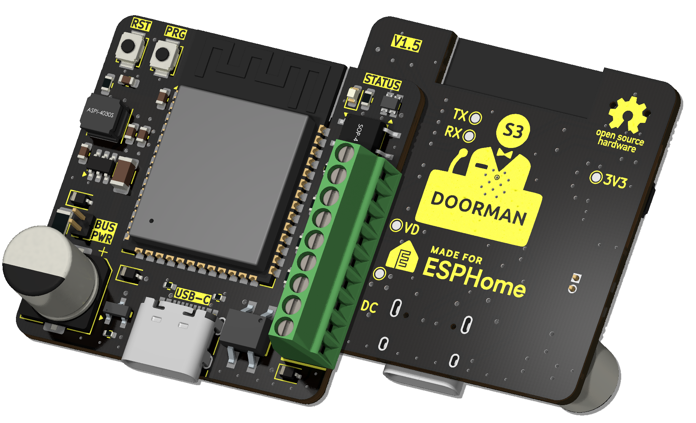

{width=500px}

# Was ist Doorman?

Doorman ermöglicht es dir, deine [TCS](https://www.tcsag.de/) oder [Koch](https://www.kochag.ch/) Gegensprechanlage mit jedem Heimautomatisierungssystem zu verbinden. Zusätzlich sind einige umgebrandete [Niko](https://www.niko.eu/) und [Scantron](https://scantron.dk/) Gegensprechanlagen Gegenstücke zu den TCS- und Koch-Modellen.

### Was ist mit anderen Gegensprechanlagen?
Doorman ist nicht auf TCS- oder Koch-Gegensprechanlagen beschränkt.\
Du kannst ihn auch verwenden, um einen Tastendruck zu simulieren und damit einen Türöffner oder Licht mit dem integrierten Solid-State-Relais (bis zu 40V, max. 2,5A) auszulösen.

Wenn deine Gegensprechanlage auf einem 2-Draht-Bus im Bereich von 14-24V DC arbeitet, könnte es möglich sein, auch andere Protokolle zu implementieren.

Alternativ kannst du den Spannungspegel auf älteren Gegensprechanlagen (14-24V DC) [mithilfe des internen ADC überwachen](firmware/stock-firmware#advanced-examples) und spezifische Aktionen basierend auf den Messwerten auslösen.

Du hast gerade deinen Doorman erhalten? Geh direkt zur [Quickstart](getting-started) Anleitung.

## Features

- Angetrieben vom ESP32-S3
- USB-C Anschluss zum einfachen Flashen (und weil USB-C einfach cool ist 😎)
- Kompaktes Design, das fast überall passt
- Einstellbare WS2812B RGB LED zur Anzeige bestimmter Ereignisse
- Zwei zusätzliche GPIOs zur einfachen Erweiterung mit eigenen Sensoren und Geräten (z.B. I²C)
- Solid-State-Relais zum Schalten von Lasten bis zu 40V (max. 2,5A), ideal für ältere Gegensprechanlagen
- Externer Button (G + BTN)
- Brückengleichrichter zur Korrektur der Bus-Leitung-Polarität
- TCS-Bus-Kommunikation für Funktionen wie das Öffnen der Haustür und das Erkennen der Klingel
- Kann als Nuki Bridge mit der [Nuki Bridge Firmware](firmware/nuki-bridge-firmware) verwendet werden. Beachte, dass diese Firmware nicht mit der Nuki App kompatibel ist, aber mit der Home Assistant App funktioniert.

## Möchtest du auch einen?

Wenn du Fragen hast, kannst du mich gerne auf [Discord](https://discord.gg/t2d34dvmBf) oder per [E-Mail](mailto:flo@azon.ai?subject=Doorman) erreichen.

Ich habe auch vollständig gelötete und getestete Doorman-S3 im Angebot, die schon mit der [Stock Firmware](firmware/stock-firmware) geflasht sind. Diese können direkt in Home Assistant integriert werden.