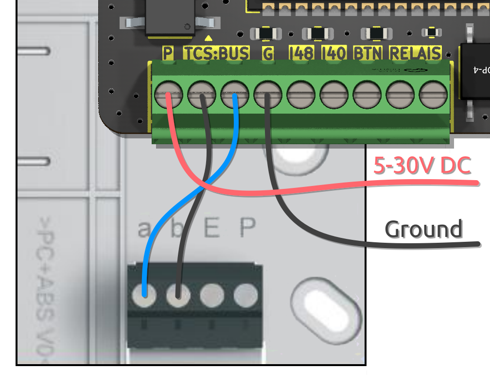
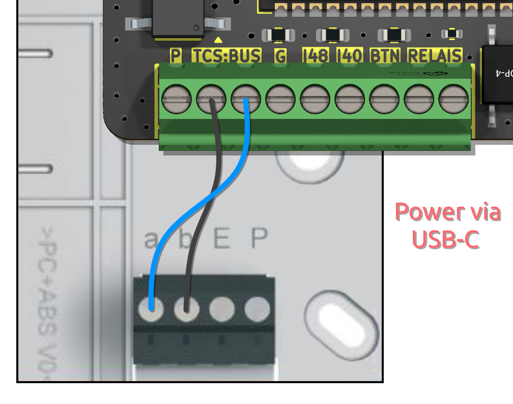
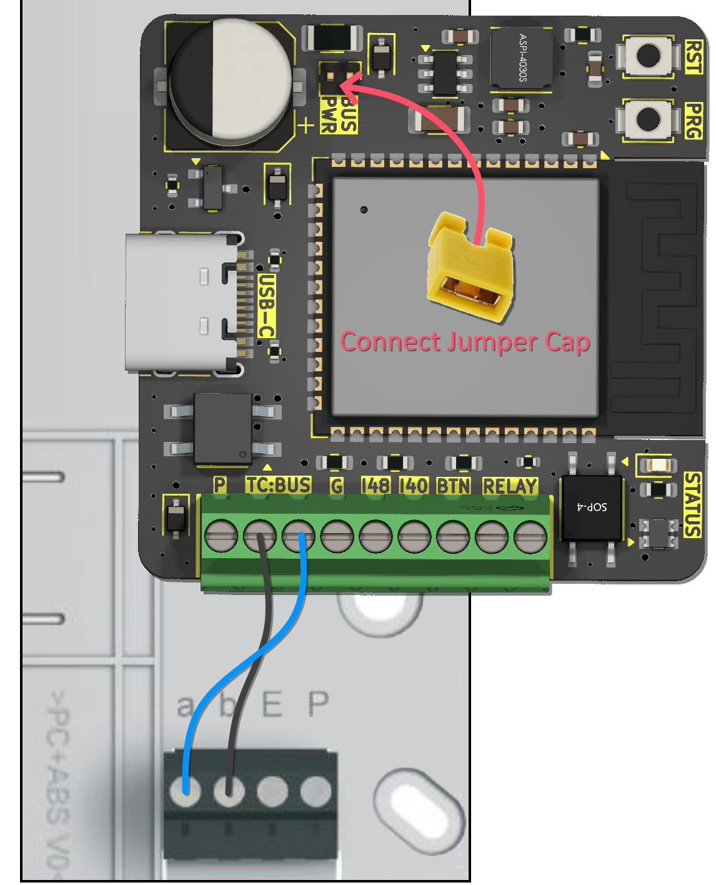
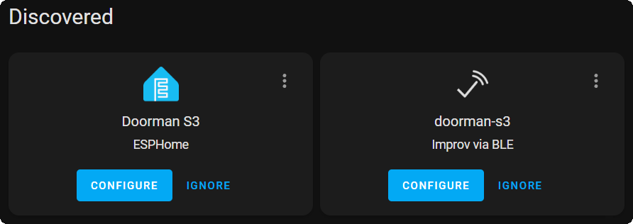

# Getting Started

Is this your first time here? Don't worry, we've got you covered!
Below, you'll find a detailed guide for setting up your Doorman for the first time.

Please note that these instructions are based on the pre-flashed Doorman PCB that I sell. If you've had a PCB manufactured yourself, make sure to flash the firmware first; otherwise, you might be waiting a long time for anything described below to happen. 😄

**Thank you so much for using Doorman! ❤️**

## Wiring
First, open your intercom enclosure. On most models, you will find a screw terminal labeled with `a`, `b`, `E`, and `P`.

Connect the `b` line (Ground) to one of the TC:BUS terminals on your Doorman, and connect the `a` line (24V Bus) to the other TC:BUS terminal on your Doorman.

::: warning Note
By default, I ship version 1.5 with a jumper cap on `BUS PWR`. Please remove this if you are not connecting Doorman in the `2-Wire Mode via intercom` configuration.
:::

### Power supply options:
::: details 3-Wire Mode via intercom <Badge type="tip" text="Recommended" />
Connect the `P` line (+24V) to the `P` terminal on your Doorman.

> [!WARNING]
> The intercom power supply must provide at least 60mA.

Example:
{width=300px}
:::

::: details 2-Wire Mode via external wired Power Supply
Connect the external power supply to your Doorman using the `P` (+5V to +30V) and `G` (Ground) screw terminals.

Example:
{width=300px}
:::

::: details 2-Wire Mode via external USB-C Power Supply
Connect the external power supply via the USB-C port.

Example:
{width=300px}
:::

::: details 2-Wire Mode via intercom <Badge type="danger" text="Hardware revision 1.5 and later" />
> [!DANGER] Important Info
> Using the `a`-bus line as a power source on revisions older than `1.5` results in a loud beeping noise. This issue is likely due to the high-frequency switching power supply.
>
> Starting with revision `1.5` this method will only produce a subtle, yet noticeable hissing sound on the speaker.

After connecting the `a` and `b` lines, you need to connect `BUS PWR` using a jumper cap.

Example:
{width=300px}
:::


## Setup

### Step 1: Connect to Wi-Fi
When you power on your Doorman-S3 for the first time, it will blink rapidly (orange) and create a new Access Point named `Doorman-S3 Setup`. You can set up your WiFi credentials using the Access Point, Improv Serial, or Improv Bluetooth.

The Access Point password is `open-sesame`.

Once connected to the Access Point, the web interface should open automatically (see also login to network notifications).\
If it doesn't, you can manually navigate to http://192.168.4.1/ in your browser.

::: tip
You can take advantage of automatic setup in Home Assistant if your Home Assistant has Bluetooth enabled.

Additionally, with mDNS support, Home Assistant will automatically discover your Doorman once it's connected to WiFi.
:::


### Step 2: Connect to Home Assistant
After connecting Doorman to your network, it will blink slowly (blue) and should be automatically discovered by Home Assistant. Simply click on `Configure` to add the newly discovered ESPHome node.

### Step 3: Interactive Setup
::: tip
When you first connect your Doorman to Home Assistant, it will be in `Setup Mode` for interactive setup already.

You don't need to manually activate this mode; it will start automatically at each reboot as long as the setup process has not been completed or canceled.
:::

1. **Access the Settings:**\
   Open the settings either through your Doorman’s internal web server or visit the [ESPHome Integration page](https://my.home-assistant.io/redirect/integration/?domain=esphome) and select the Doorman S3 device.

2. **Activate Setup Mode:**\
   Go to the `Configuration` section and enable `Setup Mode` to begin the interactive setup.

::: warning Before you proceed
The indoor station must be connected, and the enclosure securely closed, to complete the setup process.
:::

3. **Perform the Setup:**\
   The RGB status LED will pulse green-turquoise. Press the doorbell button at your apartment or entrance.

4. **Complete the Setup:**\
   After pressing the doorbell button, the system will attempt to detect your indoor station model. Once the model detection either succeeds or times out, the LED will remain green-turquoise for 3 seconds. Then, the LED will turn off, and the setup is complete.

If you have multiple door stations, the firmware will attempt to automatically detect the additional station.
To enable detection of the second doorbell and the ability to unlock the second door, you need to press the second doorbell or physically push the unlock button for the second door at least once to store its address.

## ESPHome adoption

If you want to customize your Doorman firmware, you can add the Doorman device to your [ESPHome Dashboard](https://my.home-assistant.io/redirect/supervisor_ingress/?addon=5c53de3b_esphome) and flash your customized [Stock](firmware/stock-firmware.md) or [Nuki Bridge](firmware/nuki-bridge-firmware.md) firmware.

After adding the device, your configuration will look like this:
::: details Example
> [!NOTE]
> You can add new components and modify existing ones here. For more information on the possibilities, check out the [Examples](firmware/stock-firmware#examples) section.
>
> If you need to deeply customize the firmware, you'll need to use the `base.yaml` file from the repository.

```yaml
substitutions:
  name: doorman-s3
  friendly_name: Doorman S3

packages:
  AzonInc.Doorman: github://AzonInc/doorman/firmware/doorman-stock.yaml@master

esphome:
  name: ${name}
  name_add_mac_suffix: false
  friendly_name: ${friendly_name}

api:
  encryption:
    key: ...

wifi:
  ssid: !secret wifi_ssid
  password: !secret wifi_password
```
:::