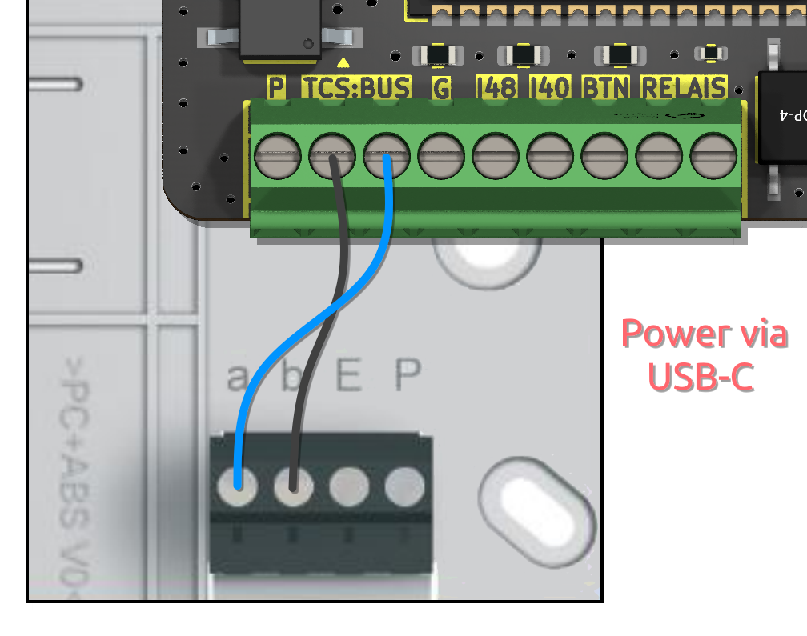

# Getting Started

First time here? Don't worry — we've got you covered! 😊

Below is a step-by-step guide to help you set up your Doorman for the very first time. Just follow along — everything is laid out in the order you need to do it.

Thank you so much for choosing Doorman and supporting this project! ❤️

## Disclaimer
By using or installing Doorman, you accept full responsibility for any modifications made to your intercom system.
System behavior may vary depending on your specific installation and environment.

If you are uncertain about any part of the setup or wiring, please consult a qualified electrician. Improper installation may result in **device malfunction or damage to your intercom system**.

:::tip NOTE
This is **not an official or certified product**. It is the result of a reverse engineering effort and is provided **as-is**, with **no guarantee of compatibility, safety, or functionality**.
:::

## Required Tools and Materials
Some tools and materials aren't usually found in every household. To set up Doorman smoothly, make sure you have:
- A small flathead screwdriver (~2 mm)
- 2–3 connecting cables (approx. 15–30 cm each)
- Electricity 🦖

Got everything? Great! Now [RTFM](https://wikipedia.org/wiki/RTFM)!!

## Flashing the Firmware
If you bought a **pre-flashed Doorman PCB**, you're good to go — skip this step! 🎉

But if you **built your own board** or need to **update the firmware**, now's the time to flash it.
Otherwise, you'll be staring at a very quiet device while wondering why nothing works. 😄

<a class="btn" target="_blank" href="./firmware/installation">Install or Update Firmware</a>

## Connect the Wires
Start by opening your indoor station's enclosure. On most models, you'll find screw terminals labeled `a`, `b`, `E`, and `P`.

The Doorman connects **in parallel** to the bus — just like any other device.

Before proceeding, review the power supply options below and choose the one that best suits your setup.

::: danger CAUTION
**NEVER connect ANY POWER SOURCE to the BUS terminals\*.  
This includes the `P` line from the intercom.** And no, Patrick, Mayonnaise is not an instrument.

As soon as Doorman attempts to transmit data on the bus, **serious and potentially irreversible damage will occur**.

Always **double-check every connection** before plugging anything in.

*The labeling on the board may vary depending on the revision: A+B, TCS:BUS, or TC:BUS.
:::

### Power supply options:
::: details 3-Wire Mode via indoor station <Badge type="tip" text="Recommended" />
> [!DANGER] IMPORTANT
> **Please remove the jumper cap on `BUS PWR` before you proceed!**
> 
> The intercom's power supply must provide **at least 60 mA**, which is usually the case.  
> However, since the available power is limited, **connecting additional devices like the Doorman S3 directly to the bus may cause instability** in the system.

Connect the `b` wire (ground) to the bus terminal labeled `B` on your Doorman, and the `a` wire (24 V bus) to the terminal labeled `B`.
In older revisions, these corresponded to the `TCS:BUS` or `TC:BUS` terminals (spanning two pins).

Then connect the `P` line (+24V) to the `P` terminal on your Doorman.

Example:
{width=300px}
:::

::: details 2-Wire Mode via indoor station <Badge type="danger" text="Hardware revision 1.5 and later" />
> [!INFO] INFO
> Using the `a`-bus line as a power source on revisions older than `1.5` results in a loud beeping noise. This issue is likely due to the high-frequency switching power supply.
>
> Starting with revision `1.5` this method will only produce a subtle, yet noticeable hissing sound on the speaker.

> [!DANGER] IMPORTANT
> The intercom's power supply must provide **at least 60 mA**, which is usually the case.  
> However, since the available power is limited, **connecting additional devices like the Doorman S3 directly to the bus may cause instability** in the system.

Connect the `b` wire (ground) to the bus terminal labeled `B` on your Doorman, and the `a` wire (24 V bus) to the terminal labeled `B`.
In older revisions, these corresponded to the `TCS:BUS` or `TC:BUS` terminals (spanning two pins).

Once connected, place a jumper cap on `BUS PWR` to enable power from the bus.

Example:
{width=300px}
:::

::: details 2-Wire Mode via external wired Power Supply
> [!DANGER] IMPORTANT
> Please remove the jumper cap on `BUS PWR` before you proceed!

> [!WARNING] KNOWN ISSUE
> You may encounter issues receiving telegrams. If this happens, you'll need an isolated power supply to eliminate ground noise.  
> The problem occurs because Doorman's power supply is not electrically isolated, which can cause ground loops when two different grounds are connected.

Connect the `b` wire (ground) to the bus terminal labeled `B` on your Doorman, and the `a` wire (24 V bus) to the terminal labeled `B`.
In older revisions, these corresponded to the `TCS:BUS` or `TC:BUS` terminals (spanning two pins).

Then connect the external power supply to your Doorman using the `P` (+5V to +30V) and `G` (Ground) screw terminals.

Example:
{width=300px}
:::

::: details 2-Wire Mode via external USB-C Power Supply
> [!DANGER] IMPORTANT
> Please remove the jumper cap on `BUS PWR` before you proceed!

> [!WARNING] KNOWN ISSUE
> You may encounter issues receiving telegrams. If this happens, you'll need a USB isolator (or example, [this one](https://amzn.eu/d/fYaZGTp)) to eliminate ground noise.  
> The problem occurs because Doorman's power supply is not electrically isolated, which can cause ground loops when two different grounds are connected.

Connect the `b` wire (ground) to the bus terminal labeled `B` on your Doorman, and the `a` wire (24 V bus) to the terminal labeled `B`.
In older revisions, these corresponded to the `TCS:BUS` or `TC:BUS` terminals (spanning two pins).

Then, power your Doorman using the USB-C port.

Example:
{width=300px}
:::

## Connect to Wi-Fi
When you power on your **Doorman S3** for the first time, the LED will **blink rapidly in yellow/orange**, indicating that it's ready to connect to Wi-Fi.

You can connect it to Wi-Fi using one of three methods:  
**Access Point** or **Improv Serial (USB)**.

### Access Point

   

   1. **Connect to the Wi-Fi network** named `Doorman S3 Setup`.
      Use the password: `Op3n-Sesame!`

   2. Once connected, the **setup page should open automatically**.
      ::: tip
      You might also see a pop-up or notification asking you to sign in to the network.
      :::

      If nothing happens, just open your browser and go to **http://192.168.4.1** or click the button below:

      

         <a class="btn" target="_blank" href="http://192.168.4.1">Connect Doorman to Wi-Fi</a>
      

   3. Enter the **Wi-Fi credentials** for the network you want your Doorman to join.

   4. Once you see **“Wi-Fi connected successfully”**, you can close the window.

   5. Your **Doorman** is now connected and ready to be added to **Home Assistant** using the **ESPHome integration**.

   

   

      
   

### Improv Serial <Badge type="tip" text="USB Connection" />
If your device isn't showing up automatically, or you're setting it up for the first time, this method is a great alternative.

Just connect your Doorman to this computer using a USB cable, then click the button below to connect it to Wi-Fi:

<improv-wifi-serial-launch-button>
   <button slot="activate">
         

            <a class="btn">Connect Doorman to Wi-Fi</a>
         

   </button>
   

         

            
OH SNAP!

            
Your browser does not support provisioning :( Please use a Chromium-based browser instead.

         

   

   

         

            
OH SNAP!

            
You are not allowed to use this on HTTP :(

         

   

</improv-wifi-serial-launch-button>

## Add to Home Assistant <Badge type="tip" text="Home Assistant integration" />

:::warning BEFORE YOU PROCEED
This is the **default** for all **pre-flashed Doorman** units.  
You can skip this step if you haven't flashed the `Home Assistant` Smart Home integration.
:::

<!--@include: ./firmware/instructions/home-assistant.md-->

## Setup MQTT Broker <Badge type="tip" text="MQTT integration" />

:::warning BEFORE YOU PROCEED
You can skip this step if you haven't flashed the `MQTT` Smart Home integration.
:::

<!--@include: ./firmware/instructions/mqtt.md-->

## HomeKit Pairing <Badge type="tip" text="HomeKit integration" />

:::warning BEFORE YOU PROCEED
You can skip this step if you haven't flashed the `HomeKit` Smart Home integration.
:::

<!--@include: ./firmware/instructions/homekit.md-->

## Interactive Setup
::: tip
When you first connect your Doorman to Home Assistant, it will be in `Setup Mode` for interactive setup already.

You don't need to manually activate this mode; it will start automatically at each reboot as long as the setup process has not been completed.
:::

::: warning BEFORE YOU PROCEED
The indoor station **must be connected**, to complete the setup process.
:::

### 1. Access the Settings
Open the settings either through your Doorman's web interface or visit the [ESPHome Integration page](https://my.home-assistant.io/redirect/integration/?domain=esphome) and select the Doorman S3 device.

### 2. Activate Setup Mode
Go to the `Configuration` (Home Assistant) or `Setup` (Doorman web interface) section and enable `Setup Mode` to begin the interactive setup.

::: tip
Access the Doorman web interface and navigate to the `Setup` section to see your current setup state.

Follow the instructions there to complete the setup.
:::

### 3. Outdoor Station Discovery
Once setup mode is activated, the RGB status LED will pulse green-turquoise **slowly** and the system will automatically scan for outdoor stations.  

🕒 This process can take **up to 30 seconds**.

::: danger DISCOVERY FAILED
If no outdoor stations are found, the LED will turn solid red and setup mode will be disabled automatically.

Make sure your outdoor station is connected and powered, then re-activate Setup Mode to try again.
:::

### 4. Ring the Doorbell
After the outdoor stations are found, the LED will pulse green-turquoise **fast** while the system waits for a doorbell press.

Press the doorbell button at your apartment or entrance. The system will save your indoor station's serial number and immediately attempt to identify the model.

### 5. Indoor Station Identification
After pressing the doorbell, the LED will pulse green-turquoise **slowly** again while the indoor station model is being identified.

::: warning IDENTIFICATION FAILED
If the model could not be identified, the LED will turn solid red for 3 seconds and setup mode will be disabled automatically.

You can **select the model manually** afterwards.  
The setup is still considered complete in this case.
:::

### 6. Memory Read
Once the indoor station model is identified, the LED will pulse green-turquoise **slowly** while the system attempts to read its memory.  

🕒 This process can take **up to 30 seconds**.

::: warning MEMORY READ FAILED
If reading the memory fails, the LED will turn solid red for 3 seconds and setup mode will be disabled automatically.

This is non-critical — the setup is still considered complete. You can re-activate Setup Mode to try again if needed.
:::

### 7. Setup complete
The LED will remain solid green-turquoise for 3 seconds, then turn off, and Setup Mode will be disabled automatically.

:::info PLEASE NOTE
The entrance door entities require address configuration before they appear. Indoor station settings require the model to be set first. If entities are still missing after configuration, restart Doorman or reload the ESPHome integration in Home Assistant.
:::

## Next Steps
You're probably looking to configure your Doorman. To get started, open the Doorman web interface or the Home Assistant [device dashboard](https://my.home-assistant.io/redirect/integration/?domain=esphome).

::: tip
The Doorman web interface is sometimes available at [doorman-s3.local](http://doorman-s3.local), or you can simply use its IP address.
:::

If you're unsure about what each entity does, what it controls, or how to configure it, check out the [Entity Reference](../reference/entities) for a detailed guide on all available entities, their functions, and setup options.

If you're a power user, don't forget to explore the [Customization](../guide/firmware/customization) section. Tailor Doorman to your exact needs and tweak it however you like.

## Still having issues?
If you're having trouble setting up your Doorman in Home Assistant, we're here to help.  
Join us on [Discord](https://discord.gg/t2d34dvmBf) to get assistance and discuss with other users.