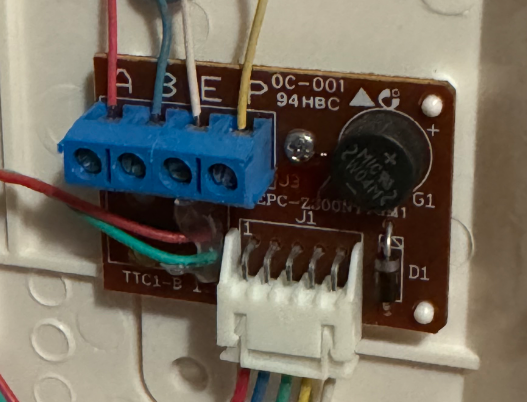

# Can I use Doorman?
If your [TCS](https://www.tcsag.de/) or [Koch](https://www.kochag.ch/) intercom has `a`, `b`, and `P` labeled screw terminals and operates on 24V DC, it's likely compatible.

Some rebranded [Niko](https://www.niko.eu/) and [Scantron](https://scantron.dk/) intercoms, which are counterparts to the TCS and Koch models, may also be compatible.

:::danger READ - BEFORE YOU ORDER
Since this product is the result of reverse engineering, there is no guarantee that your intercom will work without testing it yourself.

1. Check the wiring and measure the voltage before ordering a Doorman.

2. There is no guarantee that Doorman will work with your intercom due to the unique wiring in each building.

3. Other devices on the `P`-line (e.g., your neighbors' equipment) may draw too much current, potentially affecting Doorman's performance.

**Understand these risks before purchasing.** If you have any questions, please contact me, and I will be happy to help!
:::

## Wiring
**2-Wire Mode:**\
If your intercom is connected in 2-wire mode and you don't have a separate 24V `P`-line, use an external power supply via USB-C or the `P` (+5V to +30V DC) and `b` (Ground) screw terminals.

**3-Wire Mode:**\
If connected in 3-wire mode, you should be able to use the `P`-line to power your Doorman in most cases.

::: tip
In some installations, the `a` and `b` wires are twisted, but this is handled by Doorman's integrated bridge rectifier. Consider this when checking the voltage levels on the `a`, `b`, and `P` lines.
:::

#### Intercom Screw Terminal Explanation
- **a:** Typically the Bus line (+24V)
- **b:** Typically Ground
- **P:** The +24V line in 3-wire mode or the apartment doorbell button in 2-wire mode

::: danger
**DO NOT USE THE +24V `P`-LINE AND USB-C AT THE SAME TIME**
:::

## Check the Power Supply
Use a multimeter to check the DC voltage.\
Measure the polarity first since the `a` and `b` lines can be twisted.

#### Expected Voltage
- Between `a` and `b`: ~ 24.0V
- Between `P` and `b`: ~ 23.2V

::: warning
The intercom power supply **must have a minimum output current of 60mA** for stable operation.

If other devices using the `P`-line draw too much current, it may not be sufficient to power Doorman.

**Use an external power supply (USB-C or screw terminal) if your intercom's power supply provides less than 60mA or if you notice unstable operation.** 
:::

## Known Issues

Some intercom phones with a TTC1-B-1 connector module cause issues because the `a` and `P` connectors are somehow connected. It is not yet clear which models are affected.

::: danger Problem
A loud beeping noise occurs whenever someone is talking.
:::

{width=300px}

## Verified Hardware

::: info Note
If your intercom phone isn't listed here, it doesn't necessarily mean it's incompatible; it simply means it hasn't been tested yet.
:::

- TCS BVS20-SG / Koch BVS20
- TCS ISH 3030 / ISH 3130
- TCS ISW 3030 / ISW 3130
- TCS HST 1030
- TCS IMM 1300