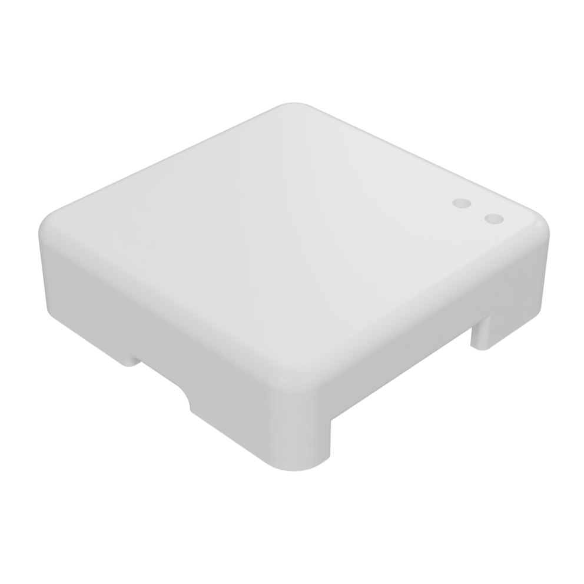
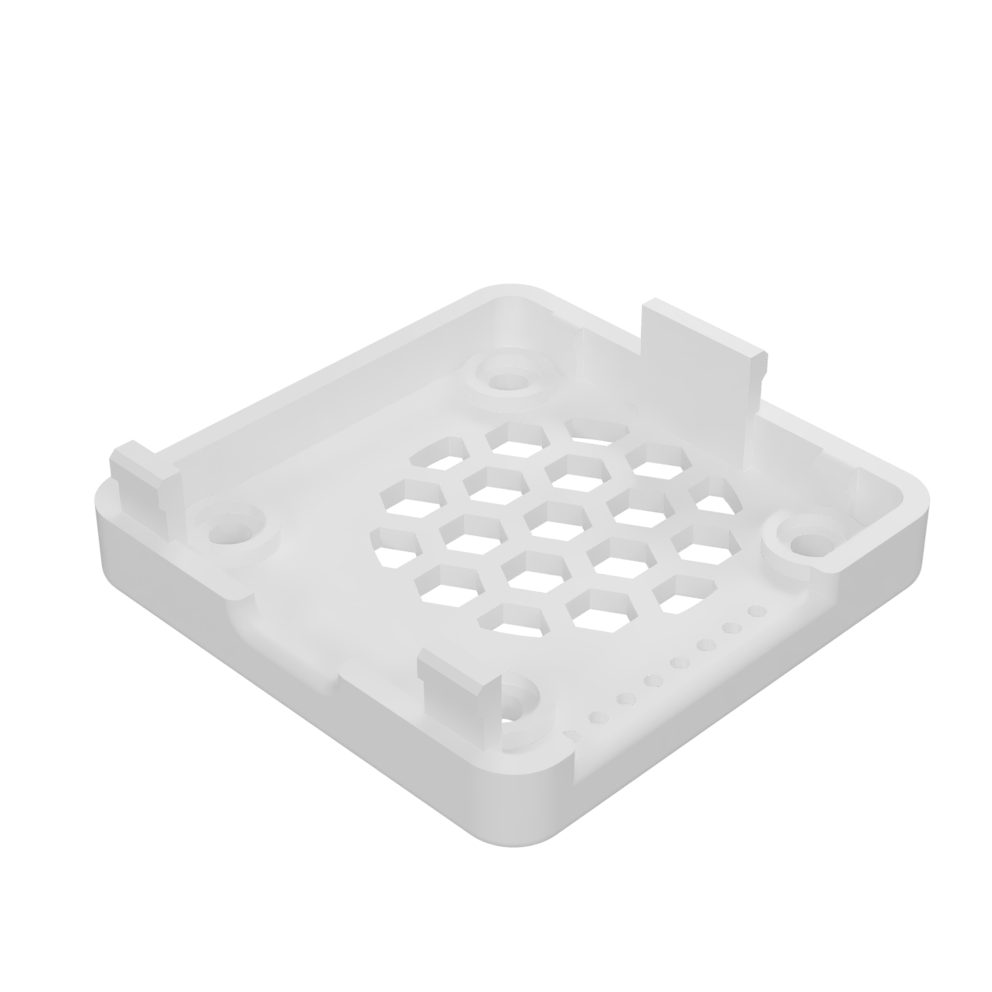

# Enclosure

In case you want an enclosure you can print your own one.\
Just click on the the images below to open the STL file on Github.

Top                                    |  Bottom
:-------------------------:|:-------------------------:
[{width=300px}](https://github.com/AzonInc/Doorman/blob/master/enclosure/Top.stl)  |  [{width=300px}](https://github.com/AzonInc/Doorman/blob/master/enclosure/Bottom.stl)

::: tip
The STL files are optimized for resin printers, you will achieve the best results by using such a printer.
:::