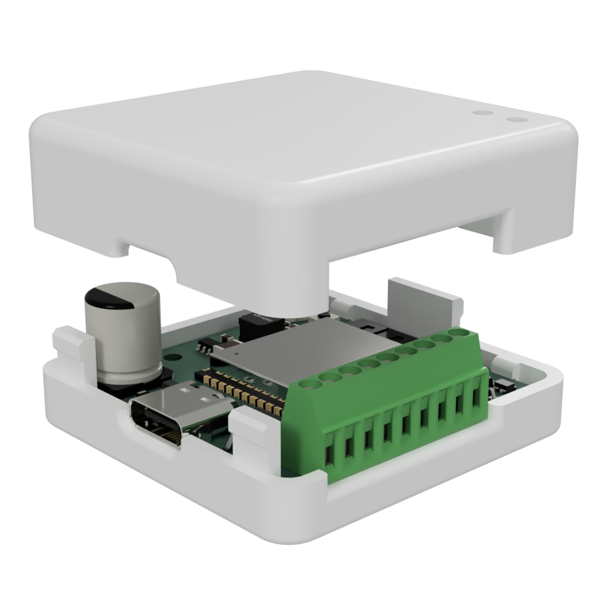

# Enclosure

In case you want an enclosure you can print your own one.\
Just use the STL files provided [here](https://github.com/AzonInc/Doorman/tree/master/enclosure) and you'll be good to go.

::: tip
As the STL files are optimized for resin printers, you will achieve the best results by using a resin printer.
:::

{width=300px}