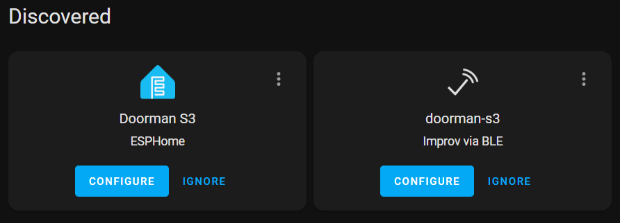
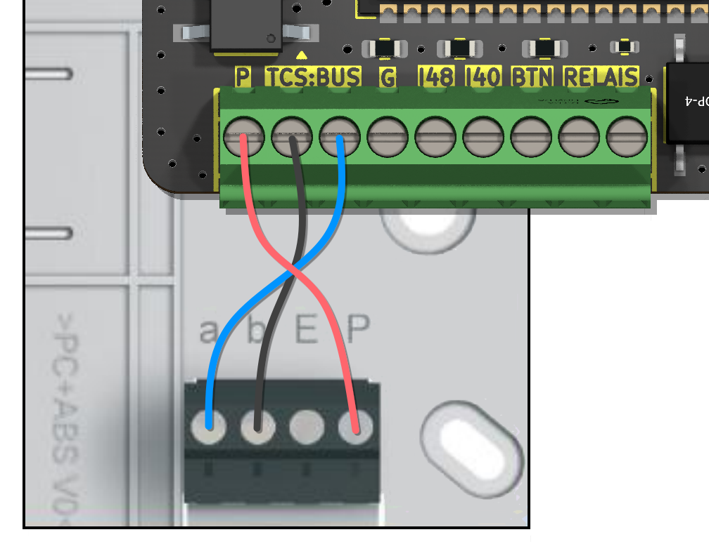
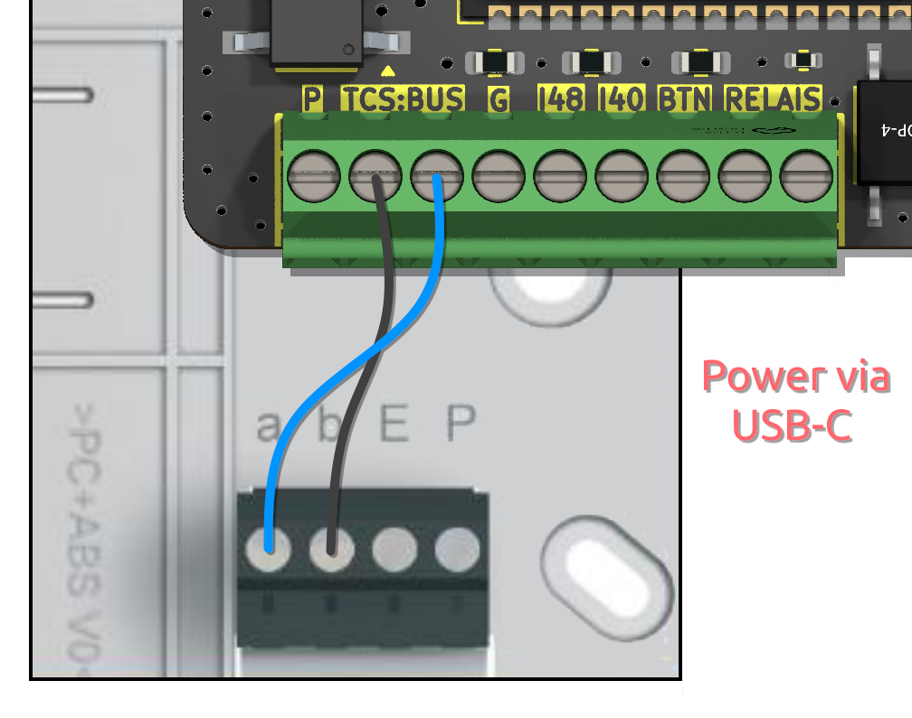

# Getting started

Here you will find a detailed guide on how to set up your Doorman for the first time. Please note that all instructions are based on the pre-flashed Doorman PCB that I sell.

Thank you for using Doorman <3

## Setup

### Network Connection
When you power on your Doorman-S3 for the first time it will blink fast (orange) and opens a new Access Point called "Doorman-S3 Setup".
The Access Point password is `open-sesame`.

You can setup your WiFi credentials via Access Point, Improv Serial or Improv Bluetooth.

::: tip
Thanks to mDNS support, Home Assistant will find your Doorman out of the box after connecting it to WiFi.
:::


### Home Assistant
After connecting Doorman to your network it will blink slowly (blue) and should be automatically discovered by Home Assistant.
Just click on `Configure` to add the newly discovered ESPHome node.

### Obtaining Bus commands
::: warning Important
You need to connect Doorman to your intercom first. Take a look at the [Wiring](#wiring) section.
:::

Every received Command is logged in the ESPHome Console (Debug Log-Level) and also published as an Home Assistant Event.

Besides that you can go to the [ESPHome Integration page](https://my.home-assistant.io/redirect/integration/?domain=esphome) and click on the new Doorman S3 device entry.
You will see a `Last Bus Command` Text Sensor which keeps track the last Bus Command in Hexadecimal.

**Important Commands:**
- Entrance Doorbell
- Apartment Doorbell
- Entrance door opener

Push the buttons on your intercom phone to capture the codes and copy them into the corresponding Configuration Text Inputs.

## ESPHome adoption

If you want to customize your Doorman Firmware you can adopt the Doorman Device into your [ESPHome Dashboard](https://my.home-assistant.io/redirect/supervisor_ingress/?addon=5c53de3b_esphome) and flash your customized [Stock](../firmware/stock-firmware.md) or [Nuki Bridge](../firmware/nuki-bridge-firmware.md) Firmware.

After adopting the device you will have a config like that:
::: details Example
> [!NOTE]
> This config is only importing the whole Doorman-Stock package. You can add new sensors and stuff here but if you really want to customize the firmware you need to use the `base.yaml` from the repository.

```yaml
substitutions:
  name: doorman-s3
  friendly_name: Doorman S3

packages:
  AzonInc.Doorman-Stock: github://AzonInc/doorman/firmware/doorman-stock.yaml@master

esphome:
  name: ${name}
  name_add_mac_suffix: false
  friendly_name: ${friendly_name}

api:
  encryption:
    key: ...

wifi:
  ssid: !secret wifi_ssid
  password: !secret wifi_password
```
:::


## Wiring
First of all you have to open your intercom enclosure.
On most models you should be greeted with a screw terminal labelled with a, b, E, P.

Now connect the b-line (Ground) to one of the TCS:BUS-Terminals of your Doorman, then connect the a-line (24V Bus) to the other TCS:BUS-Terminal of your Doorman.

### Power supply options:
::: details 3-Wire Mode via intercom (recommended)
Connect the P-line (+24V) to the P-Terminal of your Doorman.\
> [!WARNING]
> The intercom power supply needs to supply at least 60mA.

Example:
{width=300px}
:::

::: details 2-Wire Mode via external wired Power Supply
Connect the external Power Supply via P (+5V to +30V) and G (Ground) Screw Terminals to your Doorman.

Example:
{width=300px}
:::

::: details 2-Wire Mode via external USB-C Power Supply
Connect the external Power Supply via USB-C Port.

Example:
{width=300px}
:::