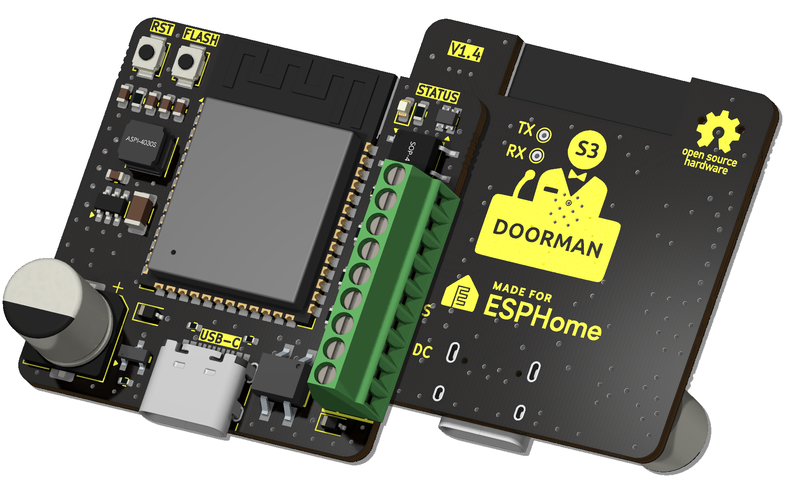

{width=500px}

# What is Doorman?

Doorman lets you connect your [TCS](https://www.tcsag.de/) or [Koch](https://www.kochag.ch/) intercom to any home automation system.
There are also some rebranded [Niko](https://www.niko.eu/) and [Scantron](https://scantron.dk/) intercoms which are counterparts of the TCS and Koch ones.

### What about other intercoms?
Doorman isn't neccessarily limited to these intercoms only.\
You can easily simulate a button press to trigger a door opener or the light with the integrated solid state relay (up to 40V, max 2.5A).

If your intercom is not a TCS or Koch one but operates on a 2-wire bus within the 14-24V DC range it might be possible to implement other protocols as well.

You can [monitor the voltage level](firmware/stock-firmware#advanced-examples) on older intercoms (14-24V DC) with the internal ADC as well and trigger specific actions based on it.

You just received your Doorman? Skip to the [Quickstart](getting-started).

## Features

- Powered by ESP32-S3
- USB-C port for easy flashing (and because USB-C is cool 😎)
- It's super small and fits almost everywhere
- Configurable WS2812B RGB LED to indicate specific events
- 2 additional GPIO for easy expansion with your own sensors and devices
- 1 solid state relay to switch up to 40V (max. 2.5A) for oldschool intercom systems
- 1 External Button (G + BTN)
- Bridge Rectifier for the Bus-wire input to correct polarity
- TCS Bus Communication (e.g. Open the front door, Detect Doorbell)
- You can use your Doorman as a Nuki Bridge with the [Nuki Bridge Firmware](firmware/nuki-bridge-firmware).\
  It is incompatible with the Nuki App but you can use the Home Assistant App.

## Interested in buying one?

Feel free to contact me on [Discord](https://discord.gg/t2d34dvmBf) or by [E-Mail](mailto:flo@azon.ai?subject=Doorman).

I offer you a fully assembled and tested Doorman-S3 which comes with the [Stock Firmware](firmware/nuki-bridge-firmware) pre-installed for direct integration and adoption into Home Assistant.